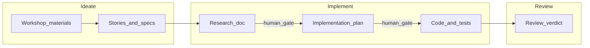

# Cursor framework (Eversis / Cursor Collections)

This guide is the **authoritative** reference for using **Cursor** (rules, Agent mode, indexed docs, MCP, and terminal-backed verification) to run a structured **Ideate → Implement → Review** workflow. It is written so you can **reuse the same patterns in many repositories**; only the per-project stack file and optional wiki sync need customization.

**Naming:** In this monorepo, user-facing and internal **prompts** and **Cursor rules** use the **`eversis-`** prefix (see **`.cursor/prompts/`** and **`.cursor/rules/`**). **Skill packages** use the same **`eversis-`** prefix on topic directories under **`.cursor/skills/eversis-*/`**. Procedural text lives in **`SKILL.md`** in Git; use the **`eversis-collections` MCP** server ([`mcp/eversis-collections-mcp/`](../mcp/eversis-collections-mcp/)) to **list, read, validate, and (where allowlisted) run** those skills in Agent via **`eversis_*` tools** — do not rely on registering the folder under Cursor’s **Agent Skills** UI (that path is not used for this framework).

**Background:** The workflow originated in [The Software House’s product engineering work](https://tsh.io) and an earlier [Copilot-oriented documentation set](https://copilot-collections.tsh.io/). **This repository is Cursor-only**; there is no second prompt tree under `.github/prompts/`.

---

## Part A — Workflow (Ideate → Implement → Review)

| Phase           | Primary role (conceptual)                                 | Cursor: attach (type **`@`** + stem, e.g. **`@eversis-implement`**) | Legacy slash name (not used in Cursor) |
| --------------- | --------------------------------------------------------- | -------------------------------------------------------------------- | -------------------------------------- |
| **Ideate**      | Business Analyst                                          | `eversis-analyze-materials`                                         | `tsh-analyze-materials`                |
| **Implement**   | Engineering Manager (orchestrates research → plan → code) | `eversis-implement`                                                | `tsh-implement`                        |
| **Review**      | Code Reviewer                                             | `eversis-review`                                                    | `tsh-review`                           |
| **Review (UI)** | UI Reviewer                                               | `eversis-review-ui`                                                | `tsh-review-ui`                        |

**Relay race:** Each phase produces a **named artifact** (transcript cleanup, Jira-ready stories, research doc, implementation plan, diffs, review with PASS / BLOCKER / SUGGESTION). The next phase must not start until a human has **reviewed and approved** the previous artifact. AI output is always a draft until you say otherwise.

**Implement internals:** Engineering Manager delegates **Research** (Context Engineer) → **Plan** (Architect) → **Implement** (Software / DevOps / E2E / Prompt Engineer by task). **Pause for human confirmation** after research and after the plan, before large code changes.

### Workflow handoff (batons and gates)



### QA handoff after Fine

When the Engineering Manager declares **Fine** (all implementation and code review done), it **always** produces a **QA comment draft in the same response** by following the **`eversis-qa-comment`** skill (`.cursor/skills/eversis-qa-comment/`). This is not optional.

**Human gate:** The draft is labeled `Draft QA comment — review before posting to Jira`. You review, edit, or rewrite it, then choose how to publish:

- **Copy-paste** the approved text into the Jira issue comment field, or
- **Ask the agent** to post via the **Atlassian MCP**: "Post this to PROJ-123 on example.atlassian.net." The agent then calls `addCommentToJiraIssue` with the approved body. It will never post without your explicit instruction, and never in the same turn as the draft.

Full usage guide, readability expectations, and example output: [website/docs/skills/qa-comment.md](https://github.com/PiotrNie-Eversis/cursor-collections/blob/main/website/docs/skills/qa-comment.md).

### How to run a prompt in Cursor

1. **User-facing** prompt bodies live under **`.cursor/prompts/public/`** (e.g. `eversis-implement.md`). **Internal** (delegation) prompts live under **`.cursor/prompts/internal/`** (e.g. research, plan, implement-ui).
2. In **Chat** or **Agent**, **prefer** attaching with **`@`** and the **file stem** (e.g. **`@eversis-implement`**, **`@eversis-research`**) so Cursor resolves the file by name. Use a full path under **`.cursor/prompts/...`** only if the file picker does not disambiguate.
3. Add **`website/docs/prompts/`** to **`.cursorignore`** if you use **sync-prompts** (this repo does), so generated copies for Docusaurus are not indexed as duplicate prompts.
4. Attach context: ticket text, `@docs/specs/...`, `@docs/context/...`, and indexed **Docs** for your stack.
5. Send a one-line instruction, e.g. “Execute this prompt for PROJ-123.”

Docusaurus may show a slash-style label (e.g. `/eversis-implement`); in the IDE, **`@` attachment is the real invocation** — not a separate slash-command runtime.

### Artifact mapping (catalog filenames)

| Legacy name                | Cursor prompt file in this repo                          |
| -------------------------- | -------------------------------------------------------- |
| `tsh-analyze-materials`    | `.cursor/prompts/public/eversis-analyze-materials.md`    |
| `tsh-implement`            | `.cursor/prompts/public/eversis-implement.md`            |
| `tsh-review`               | `.cursor/prompts/public/eversis-review.md`               |
| `tsh-review-ui`            | `.cursor/prompts/public/eversis-review-ui.md`            |
| `tsh-review-codebase`      | `.cursor/prompts/public/eversis-review-codebase.md`      |
| `tsh-audit-infrastructure` | `.cursor/prompts/public/eversis-audit-infrastructure.md` |
| `tsh-analyze-aws-costs`    | `.cursor/prompts/public/eversis-analyze-aws-costs.md`    |
| `tsh-analyze-gcp-costs`    | `.cursor/prompts/public/eversis-analyze-gcp-costs.md`    |
| `tsh-create-custom-*`      | `.cursor/prompts/public/eversis-create-custom-*.md`      |

**Deprecated flows** (no separate public file; behavior folded into ideate): old `tsh-clean-transcript` / `tsh-create-jira-tasks` style steps — use **`eversis-analyze-materials`** for the full ideate flow (see [CHANGELOG.md](../CHANGELOG.md)).

**Internal prompts** (e.g. `eversis-implement-ui`, `eversis-deploy-kubernetes`) are referenced **from** public prompts such as `eversis-implement.md` and live only under **`.cursor/prompts/internal/`** (this repo has **no** `.github/internal-prompts/` mirror).

### Roles (concept → Cursor rules)

| Conceptual role                                  | How it appears in Cursor                                                                                             |
| ------------------------------------------------ | -------------------------------------------------------------------------------------------------------------------- |
| Business Analyst, Context Engineer, Architect, … | [`.cursor/rules/eversis-*.mdc`](../.cursor/rules/) and optional [website/docs/agents/](../website/docs/agents/) docs |
| Engineering Manager (orchestration)              | `eversis-engineering-manager.mdc` + `eversis-implement` prompt                                                       |
| Code Reviewer                                    | `eversis-code-reviewer.mdc` + `eversis-review` prompt                                                                |
| Framework customization                          | Rules + [AGENTS.md](../AGENTS.md) + `eversis-create-custom-*.md` prompts + `eversis-creating-*` skills                   |

You do not need every role as a separate file on day one: start with **`eversis-agent-core.mdc`**, **`eversis-engineering-manager.mdc`** (orchestration), and **`eversis-code-reviewer.mdc`**, then split as prompts grow.

### Skills (`.cursor/skills/` on disk) + `eversis-collections` MCP

**Skills** are procedural packages (`SKILL.md` in topic folders under `.cursor/skills/eversis-*/`). **Authoring** is always in this repository (or a fork) as Markdown. **In Cursor,** enable the workspace [`.cursor/mcp.json`](../.cursor/mcp.json) and build [`mcp/eversis-collections-mcp`](../mcp/eversis-collections-mcp/) (`npm install && npm run build` in that directory). The server exposes tools such as **`eversis_skills_list`**, **`eversis_skills_get`**, and **`eversis_skills_validate`**, plus allowlisted repo scripts and **`eversis_skill_run_script`** for allowlisted per-skill scripts. That is the supported way to work with the skill tree in Agent — not a separate **Agent Skills** path in Cursor settings.

You may still namespace a **forked** copy of `SKILL.md` trees as `eversis-<topic>` in your own repo if you document your own MCP or consumption story.

### MCP

Use the same MCP servers (Atlassian, Figma, Playwright, Context7, etc.) in **Cursor Settings → MCP**, or open this repo and enable the workspace file [`.cursor/mcp.json`](../.cursor/mcp.json) when prompted. This repo also lists **`eversis-collections`** (stdio) — the local server above. Build it from **`mcp/eversis-collections-mcp/`** before first use; it is **not** published to npm.

---

## Workflow variants (playbooks)

Use the same variants as the [README](../README.md); only **which prompts you attach** and **artifact paths** change. Below, **“label”** means the Docusaurus slug / filename stem. **Attach** with **`@`** and that stem (e.g. **`@eversis-implement`**) to the file under **`.cursor/prompts/public/`** (use a full path only if the picker does not disambiguate).

### Standard flow (backend / full-stack)

- **Prompts:** `eversis-analyze-materials` → `eversis-implement` → `eversis-review`.
- **MCP:** Atlassian as needed; Context7 for framework docs.
- **Attachments:** Jira ticket or pasted description, `@docs/specs/`, `@docs/context/`.

### Frontend flow (Figma)

- **Prompts:** `eversis-implement` (orchestrates UI) and `eversis-review-ui` in a loop until PASS or escalation; then `eversis-review`.
- **MCP:** Figma Dev Mode, Playwright, Context7.
- **Attachments:** Figma links in research/plan, design tokens, component paths.

### E2E testing flow

- **Prompts:** `eversis-implement` with a task that includes E2E work; use E2E patterns in rules/skills.
- **MCP:** Playwright, repo test config.

### Workshop analysis only (ideate)

- **Prompts:** `eversis-analyze-materials` only; respect **multi-gate** review between transcript cleanup, extracted tasks, and Jira formatting.
- **MCP:** PDF Reader, Figma, Atlassian as needed.

---

## Part B — Generic Cursor packaging (any repository)

Use a layout optimized for **RAG + Agent** in Cursor:

```text
/ (root)
├── AGENTS.md                      # Optional: pointers to this doc and rule layout
├── .cursorignore                  # Exclude secrets from indexing (like .gitignore)
├── .cursor/
│   ├── rules/
│   │   ├── eversis-agent-core.mdc           # Always-on behaviors + relay workflow
│   │   ├── eversis-testing-and-terminal.mdc # Lint / test discipline
│   │   ├── eversis-accessibility.mdc        # UI-facing globs (optional)
│   │   ├── eversis-project-stack.mdc        # EDIT PER PROJECT: stack + conventions
│   │   ├── eversis-engineering-manager.mdc  # Optional: attach for eversis-implement
│   │   └── eversis-code-reviewer.mdc        # Optional: attach for eversis-review
│   └── prompts/                   # Canonical eversis-*.md (attach in Cursor with @)
│       ├── public/                # User-facing prompts
│       └── internal/              # Delegation / orchestration prompts
├── documentation/
│   └── cursor-collection.md       # This framework (can be symlinked or copied)
├── website/                       # Optional: Docusaurus site; sync prompts here before build
│   └── docs/
│       └── prompts/
│           ├── public/            # generated copy of eversis-*.md (gitignored in this repo)
│           └── internal/
├── docs/
│   ├── specs/                     # *.spec.md — spec-driven requirements
│   └── context/                   # Internal knowledge (wiki sync, architecture dumps)
├── mcp/                           # Optional: eversis-collections-mcp (local stdio server for skills)
├── scripts/
│   └── sync-internal-wiki.js      # Optional: generic name; Confluence is one backend
└── .gitlab-ci.yml                 # Or .github/workflows/ — optional scheduled sync
```

**This monorepo:** The **canonical** prompt library is **`.cursor/prompts/`** (`public/` and `internal/` **`eversis-*.md`**). **Attach** in Chat or Agent with **`@`** and the file stem (e.g. **`@eversis-implement`**) in preference to long paths. If you build the **Docusaurus** site, run **`sync-prompts`** before `docusaurus build` (this repo wires it in `website`’s `prestart` / `prebuild`) so copies land under `website/docs/prompts/` for the catalog; those copies are **gitignored** and listed in **`.cursorignore`** so they are not double-indexed. Skills live in [`.cursor/skills/`](../.cursor/skills/). Human-readable catalog: [website/docs/prompts/overview.md](../website/docs/prompts/overview.md) (after a local docs build, or read the sources under `.cursor/prompts/` on GitHub).

**Rules format:** Prefer **`.cursor/rules/*.mdc`** with YAML frontmatter (`description`, `globs`, `alwaysApply`) instead of a single giant `.cursorrules` file. Keep each rule **short and single-purpose**; see the bundled examples under [`.cursor/rules/`](../.cursor/rules/). Three activation modes:

| Mode | When to use | Example |
|------|-------------|---------|
| `alwaysApply: true` | Core behaviors that must be present in every session — keep minimal (framework rules, project stack). | `eversis-agent-core.mdc`, `eversis-project-stack.mdc` |
| `globs: [...]` (YAML list) | Scoped standards that apply whenever matching files are open — use for technology or layer-specific rules. `**/*.tsx` includes all TSX recursively. | `eversis-accessibility.mdc` |
| `globs: []`, `alwaysApply: false` | Role rules attached on demand with `@` in a prompt or Chat — keeps them out of unrelated sessions. | `eversis-engineering-manager.mdc`, `eversis-code-reviewer.mdc` |

**Indexed documentation:** Add official framework docs via Cursor’s **Docs** feature (add URLs once per workspace). In prompts, reference them with `@` **when the UI supports it** for your Cursor version. Prefer stable paths and repo-local `docs/context` for internal truth.

---

## Part C — Per-project bootstrap checklist

- [ ] Copy `.cursor/rules/` templates; **edit `eversis-project-stack.mdc`** for this repo’s stack and quality commands.
- [ ] Ensure **`eversis-*.md`** prompts exist under `.cursor/prompts/public/` (and `internal/` as needed) — in **this** repository they are already present; in a **new** repo, start from the files you need (analyze / implement / review) and adapt.
- [ ] Add `docs/specs/` and `docs/context/`; seed context with architecture or run wiki sync.
- [ ] Configure **MCP** for the workflow variants you use (Jira, Figma, Playwright, …).
- [ ] Add **`.cursorignore`**: `.env*`, keys, certificates, large secrets, vendor dumps you do not want indexed; include **`website/docs/prompts/`** if you **sync** prompt copies for Docusaurus (avoids duplicate **`@`** matches).
- [ ] Document **lint / test / typecheck** commands for this repo in `eversis-project-stack.mdc` (or `CONTRIBUTING.md`).
- [ ] Enable **Privacy mode** org-wide if required by policy (Cursor Settings → General → Privacy).
- [ ] Build **`mcp/eversis-collections-mcp/`** and enable **`eversis-collections`** in **MCP** so Agent can use **`eversis_*`** tools against `.cursor/skills/`.

---

## Part D — Internal knowledge sync (generic pattern + examples)

**Pattern (any CI, any wiki):**

1. Export selected wiki pages to Markdown (or HTML → Markdown) on a schedule.
2. Write files under `docs/context/` with clear filenames.
3. Commit and push (bot account + token); use `[skip ci]` or equivalent if your pipeline supports it.
4. Keep a **config file** (JSON/YAML) listing page IDs or URLs instead of hardcoding in the script.

### Example: Confluence + GitLab (scheduled)

Dependencies in CI: `npm install axios turndown` (or commit a minimal `package.json` in `scripts/`).

```javascript
const axios = require("axios");
const TurndownService = require("turndown");
const fs = require("fs");
const path = require("path");

const CONFLUENCE_DOMAIN = process.env.CONFLUENCE_DOMAIN;
const EMAIL = process.env.CONFLUENCE_EMAIL;
const API_TOKEN = process.env.CONFLUENCE_API_TOKEN;

const PAGES_TO_SYNC = [
  { id: "12345678", filename: "frontend-architecture.md" },
  { id: "87654321", filename: "gis-data-standards.md" },
];

const turndownService = new TurndownService({
  headingStyle: "atx",
  codeBlockStyle: "fenced",
});

async function syncPages() {
  const authHeader = Buffer.from(`${EMAIL}:${API_TOKEN}`).toString("base64");

  for (const page of PAGES_TO_SYNC) {
    try {
      const response = await axios.get(
        `https://${CONFLUENCE_DOMAIN}/wiki/rest/api/content/${page.id}?expand=body.export_view`,
        {
          headers: {
            Authorization: `Basic ${authHeader}`,
            Accept: "application/json",
          },
        },
      );

      const markdownContent = turndownService.turndown(
        response.data.body.export_view.value,
      );
      const finalContent = `---\ntitle: ${response.data.title}\nsource: Confluence\n---\n\n${markdownContent}`;

      fs.writeFileSync(
        path.join(__dirname, "../docs/context", page.filename),
        finalContent,
      );
    } catch (error) {
      console.error(`Error fetching page ${page.id}:`, error.message);
    }
  }
}

syncPages();
```

**GitLab schedule (excerpt):**

```yaml
sync_cursor_context:
  stage: maintenance
  image: node:20-alpine
  rules:
    - if: '$CI_PIPELINE_SOURCE == "schedule"'
  before_script:
    - npm install axios turndown
  script:
    - node scripts/sync-internal-wiki.js
    - git config --global user.email "bot-context@example.com"
    - git config --global user.name "Context Sync Bot"
    - git remote set-url origin "https://oauth2:${PROJECT_ACCESS_TOKEN}@${CI_SERVER_HOST}/${CI_PROJECT_PATH}.git"
    - git add docs/context/
    - git commit -m "chore(ai-context): auto-sync internal wiki [skip ci]" || echo "No changes to commit"
    - git push origin HEAD:${CI_DEFAULT_BRANCH}
```

### Example: GitHub Actions (outline)

Use `on: schedule` with `actions/checkout`, Node setup, same script, and `GITHUB_TOKEN` or a PAT with `contents: write` to push updates to `docs/context/`. Mirror the GitLab steps; adjust auth and remote URL for GitHub.

---

## Reference: Eversis stack example (fill in `eversis-project-stack.mdc`)

The following is **one** filled-in profile (Earth observation / GIS web). Other projects should replace it in **`eversis-project-stack.mdc`** only.

- **Frontend:** Angular (zoneless, Signals), Standalone components.
- **Workspace:** Nx monorepo (if applicable).
- **Styling:** Tailwind CSS v4.
- **Backend / BFF:** Node.js, Payload CMS v3 (example).
- **GIS:** OpenLayers, MapLibre.
- **Database:** PostgreSQL with PGVector.
- **Quality:** Use this repo’s Nx targets or npm scripts (e.g. `npx nx lint <project>`, `npx nx test <project>`) **only when** this is an Nx workspace; otherwise use the commands documented in `package.json`.

---

## Security checklist (tech lead)

- [ ] **Privacy mode:** Cursor Settings → General → Privacy — align with company policy for code and internal docs.
- [ ] **`.cursorignore`:** Secrets, keys, `.env`, sensitive certificates, and large PII exports.
- [ ] **Models:** Prefer your org’s approved defaults; revisit periodically as Cursor ships new models — avoid hard-coding version names in runbooks.

---

## Spec-driven development (under **Implement**)

1. Author `docs/specs/<feature>.spec.md` with acceptance criteria and links to context.
2. In Agent, attach `@<feature>.spec.md`, relevant `@docs/context/`, and `@eversis-implement`.
3. Ask for implementation **per** `.cursor/rules` and project stack.
4. After code changes, run the repo’s **documented** quality commands; fix failures before handoff.
5. Run **eversis-review** (attach `eversis-review.md` with the same spec and diff context).

This nests cleanly under **Implement → Review**; **Ideate** remains the entry for workshop-to-backlog work.
