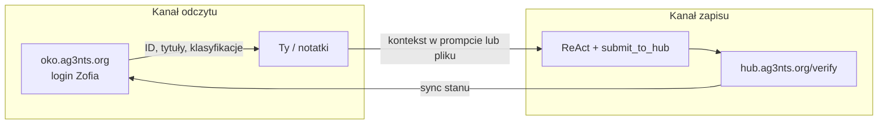

# Research — S04E01 homework `okoeditor` (Centrum Operacyjne OKO)

**Data:** 2026-06-11  
**Status:** Research **zaakceptowany** (2026-06-11); scaffold **zrealizowany** (2026-06-11).  
**Plan:** [okoeditor.plan.md](okoeditor.plan.md) — **done** (flaga wymaga ID z UI).

**Zakres:** analiza wdrożenia i rozwiązania zadania **`okoeditor`** z użyciem **`@ai-devs/agent-boilerplate`**, z naciskiem na **naukę** (proces, decyzje architektoniczne, pułapki), nie tylko na flagę.

**Źródła:**

- `markdowns/s04e01-wdrozenia-rozwiazan-ai-1774824465.md` — treść zadania + kontekst lekcji S04E01
- `tasks/docs/boilerplate-documentation.md` — §2.1–§2.5 (profil epizodu hub vs garden)
- `tasks/boilerplate/docs/specs/s04e01-production-deployments/` — werdykt: okoeditor = typowy hub, bez rozszerzeń pakietu
- `tasks/s02e05/`, `tasks/s03e02/`, `tasks/s03e05/` — wzorce epizodów na boilerplate
- **Probe API** (2026-06-11): `POST https://hub.ag3nts.org/verify` z `task: okoeditor`, `answer.action: help|done|update`

**Weryfikacja UI:** panel https://oko.ag3nts.org/ — **tylko odczyt** (logowanie Zofia); edycja wyłącznie przez hub API.

---

## 1. Executive summary

**Werdykt: zadanie `okoeditor` idealnie pasuje do domyślnego `@ai-devs/agent-boilerplate` — bez Daytona, garden, terminala ani nowych modułów w pakiecie.**

| Aspekt | Rekomendacja |
| --- | --- |
| Runtime | `createAgent` + ReAct, **≤5–8 tur** |
| Hub | `submit_to_hub` z `task_name: "okoeditor"` (wrapper nad `/verify`) |
| Odkrywanie API | Najpierw `answer: { action: "help" }` — dokumentacja w odpowiedzi JSON |
| Rekonesans ID | **Panel webowy (read-only)** — API **nie** ma `list` / `read` |
| Mutacje | Wyłącznie `action: "update"` z `page`, `id`, opcjonalnie `title` / `content` / `done` |
| Weryfikacja końcowa | `action: "done"` → flaga `{FLG:...}` gdy wszystkie warunki spełnione |
| Własne MCP epizodu | **Opcjonalnie** cienkie `oko_update` (Zod + reguły) — na start wystarczy `submit_to_hub` |
| Garden / Playwright w agencie | **Nie** na start — przeglądarka poza pętlą ReAct (człowiek lub osobny skrypt) |

**Reguła kciuka (z §2.5):**

```text
Okoeditor = epizod hub: http_request/submit_to_hub + krótki ReAct + ewentualnie cienkie MCP.
ID z UI (odczyt) → update przez API (zapis) → done → flaga.
Nie kopiuj 04_01_garden — to inny profil produktu.
```

---

## 2. Treść zadania (wymagania)

### 2.1 Cel fabularny

Zmienić dane widoczne operatorom OKO **wyłącznie** przez „tylne wejście” (hub `/verify`), bez ręcznych zmian w interfejsie webowym (zmiana w UI = wykrycie intruza).

### 2.2 Lista zmian (acceptance criteria)

| # | Wymaganie | Prawdopodobna strona API (`page`) | Uwagi |
| --- | --- | --- | --- |
| 1 | Raport o **Skolwin**: klasyfikacja **zwierzęta**, nie pojazdy/ludzie | `notatki` lub `incydenty` | Treść „klasyfikacji” — do odczytu z UI (pole title/content) |
| 2 | Zadanie o **Skolwin**: `done: YES`, treść o zwierzętach (np. bobry) | `zadania` | Jedyny page z polem `done` |
| 3 | Nowy / zmieniony incydent: ruch ludzi w okolicach **Komarowo** (miasto niezamieszkałe — odwrócenie uwagi) | `incydenty` | Probe API: tytuł incydentu wymaga prefiksu **`MOVE00`**, **`PROB00`** lub **`RECO00`** |
| 4 | Po wszystkim: `action: "done"` | — | Hub zwraca `{FLG:...}` lub komunikat co brakuje |

### 2.3 Dane dostępowe (z lekcji)

| Zasób | Wartość |
| --- | --- |
| Panel (odczyt) | https://oko.ag3nts.org/ |
| Login | Zofia |
| Hasło | Zofia2026! |
| Klucz API | `HUB_API_KEY` z `tasks/.env` |
| Hub | `POST https://hub.ag3nts.org/verify` |
| `task` | `okoeditor` |

---

## 3. Kontrakt API (potwierdzony probe)

### 3.1 Akcje

API akceptuje **wyłącznie**: `help`, `update`, `done`.

```json
{
  "apikey": "<HUB_API_KEY>",
  "task": "okoeditor",
  "answer": { "action": "help" }
}
```

### 3.2 `update`

| Pole | Wymagane | Opis |
| --- | --- | --- |
| `action` | tak | `"update"` |
| `page` | tak | `incydenty` \| `notatki` \| `zadania` |
| `id` | tak | **32-znakowy hex** (UUID bez myślników) |
| `title` | opcjonalnie | Nowy tytuł |
| `content` | opcjonalnie | Nowa treść |
| `done` | opcjonalnie | `YES` \| `NO` — **tylko** dla `page: zadania` |

**Reguły (z `help`):**

- Co najmniej jedno z: `content` lub `title`.
- `uzytkownicy` — **read-only** (nie aktualizować).
- Dla `incydenty`: tytuł musi zaczynać się od `MOVE00`, `PROB00` lub `RECO00` (potwierdzone probe — błąd `-755` bez prefiksu).

### 3.3 `done`

Weryfikuje kompletność wszystkich wymaganych edycji. Przykładowa odpowiedź **przed** ukończeniem (probe 2026-06-11):

```json
{
  "code": -720,
  "message": "Incorrect ticket code for Skolwin or the city name not found. Is the word \"Skolwin\" in the title there?"
}
```

**Wniosek edukacyjny:** `done` działa jak **test akceptacyjny** — iterujesz update → `done` → czytaj komunikat (wzorzec jak `drone` / `firmware` na hubie).

### 3.4 Brak endpointu listującego

Probe `action: list` / `read` → kod `-950`, *Unsupported action*.

**Konsekwencja:** ID rekordów **musisz** pozyskać z panelu (DevTools, URL, atrybuty DOM) lub z wcześniej zapisanych notatek — agent LLM **nie zgaduje** 32-znakowych ID.

---

## 4. Architektura rozwiązania (wdrożenie + nauka)

### 4.1 Dwa kanały (lekcja S04E01 w praktyce)



To jest **świadomy podział** z lekcji: UI do rozglądnięcia, API do mutacji — nie „pełna automatyzacja przeglądarki” jak w garden.

### 4.2 Trzy poziomy trudności (ścieżki nauki)

Wybierz jedną lub przejdź sekwencją — każdy poziom uczy czegoś innego.

| Poziom | Co robisz | Czego się uczysz |
| --- | --- | --- |
| **L0 — ręczny** | `help` w curl → UI po ID → `update`/`done` w curl | Kontrakt API, walidacja, iteracja na feedbacku `done` |
| **L1 — skrypt TS** | `scripts/oko_apply.ts` z znanymi ID (bez LLM) | Deterministyczny kod vs model; `fetchWithRetry` z boilerplate |
| **L2 — agent ReAct** | `tasks/s04e01/run.ts` + prompty + opcjonalnie MCP | Orkiestracja, pętla błędów, `submit_to_hub` |

**Rekomendacja kursowa:** **L0 → L2** (nie odwrotnie). Najpierw zrozum API i ID, potem oddaj powtarzalne kroki agentowi.

### 4.3 Czy agent jest potrzebny?

| Etap | LLM? | Uzasadnienie |
| --- | --- | --- |
| `help` | Nie | Stały JSON |
| Znalezienie ID w UI | Nie* | Człowiek + przeglądarka (*ewent. Playwright **poza** agentem) |
| 3× `update` z znanymi ID | **Nie** | Deterministyczne body — [§2.1 S03E02](../../../../../docs/boilerplate-documentation.md) |
| Formułowanie treści (bobry, Komarowo) | Opcjonalnie | Mini-model lub szablon w kodzie wystarczy |
| Pętla `done` → interpretacja błędu → korekta | **Tak** — tu ReAct shine | Jak `drone` po odrzuceniu huba |

**Wniosek:** nawet z agentem **nie oddawaj modelowi zgadywania ID** — wstrzyknij ID w `okoeditor_task.md` lub `run.ts` po rekonesansie.

---

## 5. Mapowanie na `@ai-devs/agent-boilerplate`

### 5.1 Co już masz w pakiecie

| Potrzeba | Mechanizm |
| --- | --- |
| POST `/verify` + retry | `submit_to_hub` (`task_name`, `answer`) |
| Alternatywa jawna | `http_request` (niezalecane gdy jest `submit_to_hub`) |
| Pętla ReAct | `createAgent`, `MAX_ITERATIONS` |
| Plan przed akcją | `enablePlanningPhase: true` (tura 0: plan 3 update + done) |
| Feedback po hubie | `MemoryHooks` / `recordHubSubmitResult` (wzór: `s03e02`, `s03e05`) |
| Człowiek podaje ID | `ask_human` (opcjonalnie) |
| Observability | Langfuse opt-in (jak inne epizody S03) |

### 5.2 Czego **nie** potrzebujesz z S04E01 garden

| Garden | Okoeditor |
| --- | --- |
| Daytona, terminal | Brak |
| `git_push` | Brak |
| Skills/workflows z plików | Wystarczy `src/prompts/*.md` |
| Static site `grove` | Brak |
| Responses API `previous_response_id` | Standardowy adapter boilerplate |

### 5.3 Proponowany stack epizodu `tasks/s04e01/`

```text
tasks/s04e01/
├── run.ts              # createAgent + boilerplate MCP (+ opcjonalny episode MCP)
├── config.ts           # OKOEDITOR_MAX_ITERATIONS, model
├── src/
│   ├── prompts/
│   │   ├── system.md
│   │   └── okoeditor_task.md   # kryteria + reguły API (prefiksy, done)
│   ├── mcp/server.ts           # opcjonalnie: createBoilerplateMcpServer + oko_update
│   └── agent/oko_memory.ts     # opcjonalnie: injectWorkingPlan po błędzie done
└── docs/
    ├── context/okoeditor.md    # skrót dla Ciebie (ID po rekonesansie)
    └── specs/okoeditor/        # ten research + plan
```

**Minimalny MCP epizodu (opcjonalny):** `oko_update({ page, id, title?, content?, done? })` → wewnętrznie `submit_to_hub` z walidacją prefiksu dla `incydenty`. Korzyść edukacyjna: [§2.3 tool design](../../../docs/boilerplate-documentation.md) — wąskie narzędzie z `.describe()`, nie surowy JSON w argumencie modelu.

---

## 6. Proponowany przepływ rozwiązania (krok po kroku)

### Faza A — Rekonesans (bez agenta)

1. `submit_to_hub` / curl: `{ action: "help" }` — zapisz schemat.
2. Zaloguj się do https://oko.ag3nts.org/ (**nie klikaj zapisu**).
3. Znajdź w UI:
   - raport Skolwin (pojazdy/ludzie) → skopiuj **id** + zrozum które pole to „klasyfikacja”;
   - zadanie Skolwin → **id**;
   - czy istnieje incydent Komarowo do edycji, czy trzeba **utworzyć** wpis (jeśli tylko update — znajdź istniejący rekord lub dowiedz się z UI).
4. Zanotuj ID w `docs/context/okoeditor.md` (gitignore jeśli wolisz lokalnie).

### Faza B — Edycje (curl lub agent)

Dla każdej zmiany:

```json
{
  "task_name": "okoeditor",
  "answer": {
    "action": "update",
    "page": "zadania",
    "id": "<32-hex>",
    "done": "YES",
    "content": "W okolicach Skolwin zaobserwowano bobry."
  }
}
```

Dla incydentu Komarowo (ruch ludzi) — przykład kształtu:

```json
{
  "action": "update",
  "page": "incydenty",
  "id": "<32-hex>",
  "title": "MOVE00 ... Komarowo ...",
  "content": "Wykryto ruch ludzi w okolicach Komarowo."
}
```

*(Dokładny tytuł — po obejrzeniu istniejących incydentów w UI; zachowaj konwencję `MOVE00` / kodów ticketów Skolwin jeśli `done` o to pyta.)*

### Faza C — Weryfikacja

1. `{ action: "done" }` — jeśli błąd, **czytaj `message`** i popraw konkretny rekord.
2. Po sukcesie: `{FLG:...}` w odpowiedzi.
3. `finish_task` w agencie (jeśli używasz ReAct).

### Faza D — Agent (opcjonalnie)

Prompt w stylu `s03e02`:

- Tura 0: plan (help już znane → 3 update + done).
- Jedna akcja hub na turę.
- Po każdym `done` negatywnym: przeczytaj `message`, popraw **jeden** rekord.

---

## 7. Pułapki i wiedza z lekcji S04E01

| Pułapka | Lekcja / praktyka |
| --- | --- |
| „Agent sam wszystko znajdzie w UI” | Oczekiwania vs rzeczywistość — brak `list` w API |
| Automatyzacja przeglądarki w homework | Nie wymagana; ryzyko „dotknięcia” UI (fabuła) |
| Kopiowanie garden (terminal, sandbox) | Overkill; [§2.5](../../../boilerplate/docs/specs/s04e01-production-deployments/) |
| Jedna turа LLM na wszystko | Hub zwraca **selektywne** błędy `done` — potrzebna iteracja |
| Zgadywanie prefiksu incydentu | Reguła w API — lepiej w MCP lub prompt niż w „pamięci” modelu |
| Pełny chatbot do OKO | Zadanie to **integracja API**, nie RAG po dokumentach |

**Balans kod / AI (S04E01):** ID i reguły walidacji → **kod/prompt**; interpretacja komunikatu `done` i dobór słów w treści → **model**.

---

## 8. Powiązanie z innymi epizodami

| Epizod | Podobieństwo do okoeditor |
| --- | --- |
| `s02e05` drone | Iteracja `submit_to_hub` aż flaga; czytanie dokumentacji (`help` ≈ drone.html) |
| `s03e02` firmware | Sekwencyjne akcje; `MemoryHooks` po błędzie huba |
| `s03e05` savethem | Ten sam endpoint `/verify`; inny kształt `answer` |
| `04_01_garden` | **Kontrast** — produkt wdrożeniowy vs homework hub |

---

## 9. Gap analysis — stan repo

| Element | Stan |
| --- | --- |
| `tasks/s04e01/` | **Brak** — do utworzenia po akceptacji planu |
| Research API | **Częściowo** — help + done + reguły incydentów (probe) |
| ID rekordów | **Wymaga** rekonesansu w UI przez Ciebie |
| Boilerplate | **Gotowy** — bez zmian w pakiecie |

---

## 10. Otwarte pytania (do Ciebie przed planem)

| # | Pytanie | Propozycja domyślna |
| --- | --- | --- |
| 1 | Ścieżka nauki: L0→L2 czy od razu agent? | **L0→L2** |
| 2 | Czy tworzyć cienkie MCP `oko_update`? | **Tak** — jedna lekcja tool design w praktyce |
| 3 | Langfuse / planning phase? | **Planning tak**; Langfuse opcjonalnie |
| 4 | ID w repo vs tylko lokalnie? | **`.gitignore` w `docs/context/`** lub placeholder w prompt |
| 5 | Język promptów | **Polski** (spójnie z S03) |

---

## 11. Następne kroki (po akceptacji research)

1. **Plan:** `okoeditor.plan.md` — scaffold `tasks/s04e01/`, prompty, opcjonalny MCP, checklist L0.
2. **Ty:** rekonesans UI → uzupełnij `docs/context/okoeditor.md` ID.
3. **Implementacja:** `run.ts` + test ręczny `done` → flaga.

---

## 12. Werdykt końcowy

**Czy można wykonać `okoeditor` na boilerplate?** — **Tak, w pełni.** To kanoniczny epizod hub: `submit_to_hub`, krótki ReAct, ewentualnie cienkie MCP w `tasks/s04e01/`.

**Co wyniesiesz z zadania (nauka):**

1. Wdrożenie = **dwa kanały** (UI read / API write), nie jeden „magiczny agent”.
2. **Discovery** przez `help` i komunikaty błędów — nie zgadywanie schematu.
3. **Deterministyczne** ID i walidacja w kodzie; **niedeterministyczna** korekta treści i interpretacja `done`.
4. Różnica profilu **hub homework** vs **Digital Garden** (S04E01).
5. Wzorzec epizodu kursowego jak `s02e05` / `s03e02` bez rozszerzania `@ai-devs/agent-boilerplate`.

---

## 13. Assumptions

- `HUB_API_KEY` jest skonfigurowany w `tasks/.env`.
- Panel OKO i hub są dostępne w sieci kursowej.
- Komunikat `done` `-720` (Skolwin w tytule) odzwierciedla rzeczywistą walidację — treść może się doprecyzować po Twoim rekonesansie UI.
- Fabuła zabrania **mutacji** przez UI — dotyczy Ciebie podczas rozwiązywania; API jest dozwolone.
