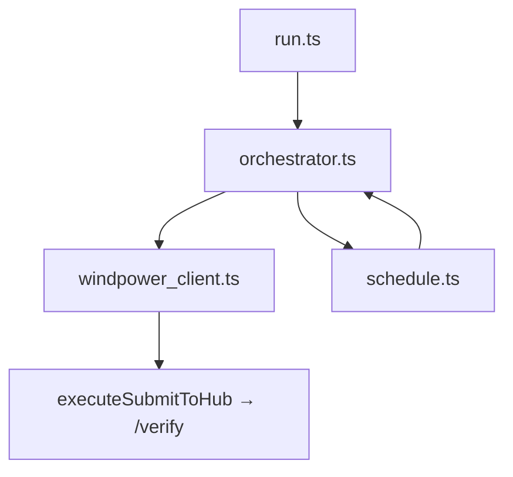

# Plan wdrożenia — S04E02: `windpower` (orchestrator + boilerplate)

**Normatywny research:** [s04e02-windpower.research.md](s04e02-windpower.research.md) — zaakceptowany (2026-06-17).  
**Workspace:** `tasks/s04e02/` + aktualizacja root `README.md` + `CHANGELOG.md`  
**Status:** Plan zrealizowany (2026-06-17) — E2E `{FLG:IVEGOTTHEPOWER}` ~38 s.

**Weryfikacja UI:** brak — zadanie nie dotyczy frontendu ani Figma.

---

## 1. Zakres (scope)

**W zakresie:**

| Element | Opis |
| --- | --- |
| **`tasks/s04e02/`** | Nowy epizod npm `@ai-devs/s04e02` na `@ai-devs/agent-boilerplate` |
| **Tryb domyślny: orchestrator TS** | `run.ts` → deterministyczny flow (40 s, równoległość, poll) — **bez LLM** |
| **`windpower_client.ts`** | Wrapper `executeSubmitToHub` — akcje `{ action: "..." }` dla task `windpower` |
| **`schedule.ts`** | Reguły domenowe: wichury, tryb ochronny, pierwsze okno produkcji, format godzin `:00:00` |
| **`orchestrator.ts`** | `help` → `start` → parallel queue → poll → unlock codes → `config` → `turbinecheck` → `done` |
| **Testy jednostkowe** | Mock fetch / pure functions: schedule, poll state machine, client envelope |
| **`tasks/s04e02/README.md`** | Architektura (orchestrator vs ReAct), env, uruchomienie, mapa edukacyjna |
| **Root `README.md`** | Wiersz `s04e02` w tabeli Tasks |
| **`CHANGELOG.md`** | Wpis `[Unreleased]` — epizod windpower |
| **Research** | Status + rozwiązane open questions |

**Poza zakresem:**

- Zmiany w `@ai-devs/agent-boilerplate` (`src/`, `parallelToolCalls`, nowe deps)
- Tryb ReAct jako domyślny (może być **opcjonalny** `--agent` — faza E, defer jeśli brak czasu)
- Langfuse / OM / tool discovery (niepotrzebne przy orchestratorze)
- E2E hub w CI (wymaga sekretów)
- Dokumentacja §2.6 (już zrealizowana w boilerplate docs)

---

## 2. Decyzje projektowe (human gate)

| # | Pytanie | Decyzja |
| --- | --- | --- |
| 1 | Wariant implementacji | **A — hybryda orchestrator-first** (research §3.3) |
| 2 | LLM / ReAct | **Domyślnie wyłączone**; opcjonalna faza E (`--agent`) — **defer** jeśli E2E orchestrator wystarczy |
| 3 | Hub client | **`executeSubmitToHub`** z boilerplate (wzorzec `s04e01/oko_*.ts`) |
| 4 | Docs repo | **Tak** — root `README.md` + `CHANGELOG.md` |
| 5 | `help` przed `start` | **Tak** — jednorazowo przed oknem 40 s; parsuj listę akcji / progi z odpowiedzi |
| 6 | Wiele slotów `config` | **`configs` map** — jeden POST z harmonogramem (mniej round-tripów) |
| 7 | Pomiar czasu | Log `[SYSTEM]` elapsed ms od `start`; fail fast jeśli > 38 s przed `done` |

---

## 3. Skrót researchu (kontekst planu)

| Element | Opis |
| --- | --- |
| Cel | Harmonogram turbiny: ochrona przed wichurami + pierwsze okno produkcji wymaganej mocy → `{FLG:...}` |
| Limit | **~40 s** od `action: "start"` |
| API | Async: queue → `getResult` (losowa kolejność); raporty jednorazowe |
| Podpis | `unlockCode` z `unlockCodeGenerator` per slot |
| Sekwencja końcowa | `config` → `turbinecheck` → `done` |
| Architektura | Orchestrator TS + boilerplate HTTP; ReAct **nie** na ścieżce krytycznej |

---

## 4. Current Implementation Analysis

### Already Implemented (reuse)

| Komponent | Ścieżka | Zastosowanie |
| --- | --- | --- |
| `executeSubmitToHub`, `extractFlag` | `tasks/boilerplate/src/tools/mcp/submit_to_hub.ts` | Wszystkie akcje hub |
| `fetchWithRetry` | `@ai-devs/agent-boilerplate` | Ewentualne bezpośrednie HTTP |
| `HUB_API_KEY`, `HUB_VERIFY_URL` | `boilerplate/config.ts` | Re-export w `s04e02/config.ts` |
| `logSystem`, `logAction`, `logResult` | `@ai-devs/agent-boilerplate` | Logi orchestratora |
| Wzorzec epizodu | `tasks/s04e01/` (hub actions via submit_to_hub) | Struktura MCP opcjonalna |
| Wzorzec testów | `tasks/s03e02/` | Mock `fetch`, `bun test` |

### To Be Created

| Komponent | Opis |
| --- | --- |
| `src/domain/windpower_client.ts` | `postAction(answer)`, parse hub JSON |
| `src/domain/types.ts` | Zod / typy: forecast row, config slot, queue ticket |
| `src/domain/schedule.ts` | `buildSchedule(forecast, turbineLimits, powerReq)` → `configs` map |
| `src/domain/orchestrator.ts` | Pełny scenariusz solve |
| `run.ts` | CLI entrypoint |
| `config.ts`, `package.json`, `tsconfig.json` | Bootstrap |
| Testy | `schedule.test.ts`, `orchestrator.test.ts` (mocked) |
| `README.md` | Edukacja: ReAct vs orchestrator |

### To Be Modified

| Plik | Zmiana |
| --- | --- |
| `README.md` (root) | Wiersz `s04e02` |
| `CHANGELOG.md` | Wpis Added |
| `s04e02-windpower.research.md` | Status Implemented / link plan |

---

## 5. Architektura docelowa



### Przepływ orchestratora (docelowy)

```text
Phase 0 (pre-window)
  └─ postAction({ action: "help" }) — poznaj akcje API, progi (cache lokalnie)

Phase 1 (window start)
  └─ postAction({ action: "start" }) — t0 = Date.now()

Phase 2 (parallel queue)
  └─ Promise.all([
       queueReport("forecast"),
       queueReport("turbineStatus"),      // nazwy z help — doprecyzować po help
       queueReport("powerRequirements"),
       …
     ])

Phase 3 (poll)
  └─ while pending: parallel getResult dla gotowych ticketów
  └─ każdy wynik parsuj raz; nie pobieraj ponownie

Phase 4 (schedule — pure TS, 0 tokenów)
  └─ buildSchedule() → Map<"YYYY-MM-DD HH:00:00", { pitchAngle, turbineMode, unlockCode? }>
  └─ wichura: wiatr > limit → idle + pitch ochronny
  └─ po wichurze ~1h: ponowna ochrona jeśli wirnik wraca do normy przed kolejną wichurą
  └─ pierwsze okno produkcji: gdy możliwa wymagana moc

Phase 5 (unlock codes — parallel)
  └─ Promise.all(slots.map(s => unlockCodeGenerator(s)))

Phase 6 (submit)
  └─ postAction({ action: "config", configs: { ... } })
  └─ postAction({ action: "turbinecheck" })
  └─ postAction({ action: "done" }) → extractFlag → log {FLG:...}

Guard: if Date.now() - t0 > 38_000 → throw z elapsed (debug)
```

---

## 6. Ryzyka i mitygacje

| Ryzyko | Mitygacja |
| --- | --- |
| Nieznane nazwy akcji w `help` | Faza B1: najpierw manual `help`; kod defensywny + stałe z help w README po E2E |
| 40 s przekroczone | Równoległość queue + poll; jeden POST `configs`; brak LLM na ścieżce krytycznej |
| Losowa kolejność `getResult` | Mapa `ticketId → pending`; poll w pętli aż pusta |
| Jednorazowe raporty | Set `consumed`; nigdy nie wywołuj getResult dwa razy dla tego samego |
| Błędny `unlockCode` | Osobna faza parallel generator; test jednostkowy mock odpowiedzi |
| 503 / rate limit | `executeSubmitToHub` → `fetchWithRetry` (boilerplate) |
| Reguła „godzina :00:00” | Normalizacja w `schedule.ts` + test |
| Brak `HUB_API_KEY` | `windpower_client` → throw z actionable message |

---

## 7. Security Considerations

- **`HUB_API_KEY`** — tylko env + `executeSubmitToHub`; **nigdy** w promptach ani logach pełnego klucza.
- **Brak shell / read_file** — wyłącznie hub verify API.
- **Timeout lokalny** — nie wysyłaj `done` jeśli wiadomo, że okno minęło (unikaj fałszywych submitów).

---

## 8. Kryteria akceptacji (Definition of Done)

### MVP (Fazy A–D + F)

- [ ] `bun install` + `bun test` + `bunx tsc --noEmit` z `tasks/s04e02/` przechodzą.
- [ ] `run.ts` domyślnie uruchamia orchestrator (bez `OPENAI_API_KEY`).
- [ ] Orchestrator: parallel queue + poll + `configs` + `turbinecheck` + `done`.
- [ ] `schedule.ts`: testy wichury, produkcji, normalizacji `:00:00`, wielokrotnej ochrony po wichurze.
- [ ] Logi `[SYSTEM]` / `[AKCJA]` / `[WYNIK]` na kluczowych krokach.
- [ ] `tasks/s04e02/README.md` — sekcja edukacyjna ReAct vs orchestrator.

### Docs + E2E (Fazy G–H)

- [ ] Root `README.md` — wpis `s04e02`.
- [ ] `CHANGELOG.md` — wpis `[Unreleased]`.
- [ ] Research zaktualizowany (status Implemented).
- [ ] Manual E2E: `cd tasks/s04e02 && bun run start` → hub `{FLG:...}` w **< 40 s** od `start`.

### Opcjonalnie (Faza E)

- [ ] `--agent`: MCP `orchestrate_windpower` + minimalny ReAct (edukacyjny, nie wymagany do DoD).

---

## 9. Plan fazowy i zadania

Typy: `[CREATE]`, `[MODIFY]`, `[REUSE]`.

### Faza A — Pakiet i konfiguracja

| ID | Typ | Zadanie | DoD |
| --- | --- | --- | --- |
| A1 | [CREATE] | `package.json` — `@ai-devs/s04e02`; scripts: `start`, `test`, `typecheck` | ☐ |
| A2 | [CREATE] | `config.ts` — re-export `HUB_API_KEY`, `HUB_VERIFY_URL`; `WINDPOWER_TASK = "windpower"`; `SERVICE_WINDOW_MS = 40_000` | ☐ |
| A3 | [CREATE] | `tsconfig.json`, `index.ts` | ☐ |

---

### Faza B — Hub client + discovery (`help`)

| ID | Typ | Zadanie | DoD |
| --- | --- | --- | --- |
| B1 | [CREATE] | `src/domain/windpower_client.ts` — `postWindpowerAction(answer)`, parse JSON, `extractFlag` | ☐ |
| B2 | [CREATE] | `src/domain/types.ts` — typy odpowiedzi help / queue / getResult | ☐ |
| B3 | [REUSE] | Import `executeSubmitToHub` z `../../boilerplate/src/tools/mcp/submit_to_hub.js` | ☐ |
| B4 | [CREATE] | `windpower_client.test.ts` — mock hub, brak klucza, flag extraction | ☐ |

**Szkic client:**

```typescript
export async function postWindpowerAction(
  answer: Record<string, unknown>,
): Promise<{ data: unknown; flag: string | null; ok: boolean }> {
  const res = await executeSubmitToHub({
    task_name: WINDPOWER_TASK,
    answer,
  });
  // parse mcpOk JSON text → { ok, status, data, flag? }
}
```

**Uwaga implementacyjna:** Po pierwszym live `help` uzupełnij stałe nazw akcji queue (forecast, turbine status, power requirements, unlockCodeGenerator) w `types.ts` lub `constants.ts`.

---

### Faza C — Logika harmonogramu (pure domain)

| ID | Typ | Zadanie | DoD |
| --- | --- | --- | --- |
| C1 | [CREATE] | `src/domain/schedule.ts` — `normalizeHourSlot`, `isStorm`, `buildSchedule(...)` | ☐ |
| C2 | [CREATE] | `schedule.test.ts` — fixture prognozy: wichury, okno produkcji, `:00:00`, re-ochrona +1h | ☐ |

**Wejścia `buildSchedule` (szkic):**

```typescript
type ScheduleInput = {
  forecast: ForecastEntry[];
  maxWindSpeed: number;       // z turbine status / help
  requiredPower: number;      // z power requirements
  productionPitch?: number;   // optymalny kąt — z API lub help
  protectionPitch?: number;   // kąt ochronny — z API
};
```

**Wyjście:** `Record<string, { pitchAngle: number; turbineMode: "idle" | "production"; }>` (bez unlockCode — dodawane w orchestratorze).

---

### Faza D — Orchestrator (rdzeń solve)

| ID | Typ | Zadanie | DoD |
| --- | --- | --- | --- |
| D1 | [CREATE] | `src/domain/orchestrator.ts` — `solveWindpower(): Promise<string>` (flag) | ☐ |
| D2 | [CREATE] | `queueAllReports()` — `Promise.all` enqueue | ☐ |
| D3 | [CREATE] | `pollUntilComplete()` — pętla + parallel getResult | ☐ |
| D4 | [CREATE] | `fetchUnlockCodesParallel()` — generator per slot | ☐ |
| D5 | [CREATE] | `orchestrator.test.ts` — mock client; assert kolejność akcji i równoległość (spy) | ☐ |

**Szkic poll:**

```typescript
async function pollUntilComplete(
  tickets: string[],
  getResult: (id: string) => Promise<Report | null>,
): Promise<Map<string, Report>> {
  const pending = new Set(tickets);
  const out = new Map<string, Report>();
  while (pending.size > 0) {
    await Promise.all(
      [...pending].map(async (id) => {
        const report = await getResult(id);
        if (report?.ready) {
          pending.delete(id);
          out.set(id, report);
        }
      }),
    );
  }
  return out;
}
```

---

### Faza E — Opcjonalny tryb ReAct (defer)

| ID | Typ | Zadanie | DoD |
| --- | --- | --- | --- |
| E1 | [CREATE] | `src/tools/mcp/orchestrate_windpower.ts` — cienki wrapper → `solveWindpower()` | ☐ defer |
| E2 | [CREATE] | `run-agent.ts` lub `run.ts --agent` — `createAgent` + 1 narzędzie MCP | ☐ defer |
| E3 | [CREATE] | `src/prompts/system.md` — kiedy wołać orchestrate (edukacja) | ☐ defer |

**Cel edukacyjny:** pokazać ReAct, gdzie model wybiera **jedno** narzędzie wysokiego poziomu, a szybkość zapewnia kod — nie 15 tur `http_request`.

---

### Faza F — Entrypoint

| ID | Typ | Zadanie | DoD |
| --- | --- | --- | --- |
| F1 | [CREATE] | `run.ts` — `main()` → `solveWindpower()` → print flag / exit code | ☐ |
| F2 | [REUSE] | Logger boilerplate na krokach orchestratora | ☐ |

```typescript
// run.ts (szkic)
import { solveWindpower } from "./src/domain/orchestrator.js";

const flag = await solveWindpower();
console.log(flag ?? "No flag");
```

---

### Faza G — Dokumentacja repo

| ID | Typ | Zadanie | DoD |
| --- | --- | --- | --- |
| G1 | [CREATE] | `tasks/s04e02/README.md` — quick start, architektura, ReAct vs orchestrator, env | ☐ |
| G2 | [MODIFY] | Root `README.md` — wiersz `s04e02` | ☐ |
| G3 | [MODIFY] | `CHANGELOG.md` | ☐ |
| G4 | [MODIFY] | `s04e02-windpower.research.md` — status Implemented | ☐ |

**README — sekcje obowiązkowe:**

1. Uruchomienie (`bun run start`)
2. Diagram warstw (orchestrator / boilerplate / hub)
3. Dlaczego nie pure ReAct (40 s, §5.2.1 docs)
4. Mapa komponentów boilerplate użytych w zadaniu

---

### Faza H — Weryfikacja E2E

| ID | Typ | Zadanie | DoD |
| --- | --- | --- | --- |
| H1 | [REUSE] | Manual: `cd tasks/s04e02 && bun run start` z `tasks/.env` | ☐ `{FLG:...}`, elapsed < 40 s |
| H2 | [REUSE] | Po E2E: uzupełnij stałe akcji z `help` w kodzie / README | ☐ |

---

## 10. Struktura katalogów (docelowa)

```text
tasks/s04e02/
├── package.json
├── tsconfig.json
├── config.ts
├── index.ts
├── run.ts
├── README.md
├── docs/specs/s04e02-windpower/
│   ├── s04e02-windpower.research.md
│   └── s04e02-windpower.plan.md
└── src/
    └── domain/
        ├── types.ts
        ├── windpower_client.ts
        ├── windpower_client.test.ts
        ├── schedule.ts
        ├── schedule.test.ts
        ├── orchestrator.ts
        └── orchestrator.test.ts
```

*(Faza E opcjonalnie: `src/tools/mcp/`, `src/mcp/server.ts`, `src/prompts/`)*

---

## 11. Bramki jakości

Z `tasks/s04e02/`:

```bash
bun install
bun test
bunx tsc --noEmit
bun run start    # E2E — wymaga tasks/.env (HUB_API_KEY)
```

Po każdej fazie implementujący aktualizuje checkboxy w §9 i Changelog poniżej.

---

## 12. Kolejność wdrożenia

1. **A → B** — pakiet + client + pierwszy live `help` (ręcznie lub minimalny skrypt) do ustalenia nazw akcji.
2. **C** — schedule + testy (można równolegle z B po znanym shape prognozy z help).
3. **D → F** — orchestrator + run.ts.
4. **G** — docs.
5. **H** — E2E hub (manual gate końcowy).
6. **E** — opcjonalnie po H1 PASS.

---

## 13. Human gate

**Przed implementacją:** akceptacja tego planu (orchestrator-first, bez zmian boilerplate core, fazy A–H).

**Po implementacji:** review diff + potwierdzenie E2E `{FLG:...}` w < 40 s (H1).

---

## Changelog

| Data | Zmiana |
| --- | --- |
| 2026-06-17 | Plan początkowy — windpower epizod; wariant A orchestrator-first; fazy A–H; faza E ReAct defer |
