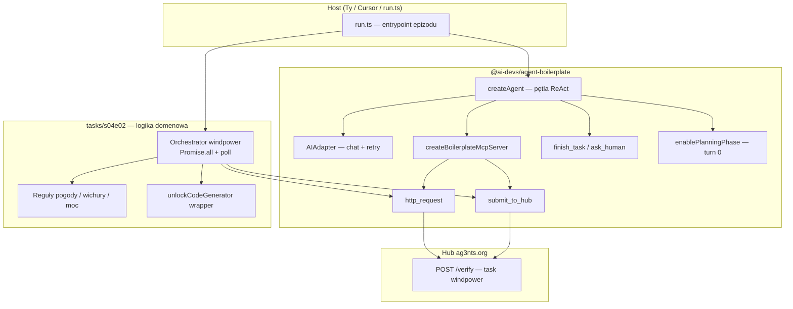

# S04E02 — windpower (homework) — research

**Task:** Ocenić, czy zadanie domowe **`windpower`** można rozwiązać z `@ai-devs/agent-boilerplate`, oraz zmapować wymagania zadania na architekturę agentów AI (edukacyjnie).

**Data:** 2026-06-17  
**Status:** Research **zaakceptowany**; implementacja **zrealizowana** (2026-06-17) — E2E PASS.

**Powiązane:**

- [s04e02-active-collaboration.research.md](../../../boilerplate/docs/specs/s04e02-active-collaboration/s04e02-active-collaboration.research.md) — lekcja S04E02 vs rozszerzenia pakietu (bez homework)
- [s03e02-firmware.research.md](../../../s03e02/docs/specs/s03e02-firmware/s03e02-firmware.research.md) — wzorzec epizodu hub na boilerplate
- [boilerplate-documentation.md](../../../docs/boilerplate-documentation.md) — §2.1, §2.6, §5.2.1

**Źródła:**

- `markdowns/s04e02-aktywna-wspolpraca-z-ai-1774908365.md` — fabuła + spec API `windpower`
- `tasks/boilerplate/` — ReAct, MCP, `http_request`, `submit_to_hub`, planning, retry
- Brak `lessons/04_02_*` w monorepo — brak kodu referencyjnego upstream

**Weryfikacja UI:** brak.

---

## 1. Executive summary

| Pytanie | Odpowiedź |
| --- | --- |
| **Czy da się rozwiązać `windpower` z boilerplate?** | **Tak** — pakiet dostarcza wszystko, czego potrzebujesz do komunikacji z hubem (`http_request`, `submit_to_hub`, retry 429/503). |
| **Czy wystarczy sam ReAct (LLM woła narzędzia sekwencyjnie)?** | **Nie** — limit **40 s** + async kolejka + konieczność **równoległości** wykluczają czystą, wolno idącą pętlę agenta. |
| **Czy trzeba rozszerzać core boilerplate?** | **Nie** — orchestracja async i `Promise.all` należą do **kodu epizodu** (MCP handler lub `run.ts`), zgodnie z §5.2.1 dokumentacji. |
| **Co uczy lekcja S04E02 vs homework?** | Lekcja: **kanały współpracy** (CLI, MCP, Slack, własny UI). Homework: **ograniczenia czasu i async API** — bliżej S03E02 (podział model vs kod) niż chat UI z lekcji. |

**Rekomendowany profil epizodu:** architektura **hybrydowa** — deterministyczny orchestrator TypeScript (szybko, równolegle) + opcjonalnie LLM tylko tam, gdzie potrzebna interpretacja prognozy pogody.

---

## 2. Task Details — `windpower`

| Field | Value |
| --- | --- |
| Task ID | `windpower` |
| Hub verify | `POST https://hub.ag3nts.org/verify` |
| Body shape | `{ "apikey", "task": "windpower", "answer": { "action": "..." } }` |
| Limit czasu | **~40 s** od `action: "start"` (okno serwisowe baterii) |
| Start | `answer.action = "start"` — otwiera okno konfiguracji |
| Discovery | `answer.action = "help"` — dokumentacja API |
| Async API | Większość akcji: kolejka → później `getResult`; wyniki w **losowej kolejności** |
| Konfiguracja | `config` (pojedyncza lub `configs` mapa dat → ustawienia) |
| Podpis | `unlockCode` z `unlockCodeGenerator` (MD5) dla każdego punktu harmonogramu |
| Weryfikacja | `turbinecheck` przed `done` |
| Sukces | flaga `{FLG:...}` z huba |

### Kroki biznesowe (z opisu)

1. **`start`** — otwórz okno serwisowe (~40 s).
2. **Równolegle** zakolejkuj potrzebne raporty (prognoza, stan turbiny, wymagania elektrowni, generator kodów… — szczegóły z `help`).
3. **Poll** `getResult` aż wszystkie raporty gotowe (kolejność losowa).
4. **Analiza prognozy:** znajdź wichury (wiatr > wytrzymałość turbiny) → tryb ochronny (`idle`, odpowiedni `pitchAngle`).
5. **Pierwsze okno produkcji:** gdy możliwa wymagana moc → tryb produkcyjny + optymalny kąt.
6. Uwzględnij: po wichurze wirnik wraca do standardu ~1 h — może wymagać **wielokrotnego** trybu ochronnego.
7. Wygeneruj `unlockCode` dla każdego slotu harmonogramu.
8. **`config`** → **`turbinecheck`** → **`done`**.

### Ostrzeżenie z zadania

> Liniowe wykonywanie wszystkich akcji nie umożliwi ukończenia zadania.

To jest **wymaganie architektoniczne**, nie sugestia — musisz projektować równoległość i polling poza wolna sekwencją „jeden HTTP na turę LLM”.

---

## 3. Werdykt: boilerplate vs wymagania zadania

### 3.1 Co boilerplate już daje (wystarczające)

| Potrzeba `windpower` | Mechanizm boilerplate |
| --- | --- |
| POST do huba z retry | `submit_to_hub` lub `http_request` + `fetchWithRetry` |
| Obsługa 503 / rate limit | Wspólna polityka retry w `ai.ts` / `http_request.ts` |
| Struktura epizodu kursowego | `createBoilerplateMcpServer`, `createAgent`, prompty `.md` |
| Logowanie kroków | `[MYŚL]`, `[AKCJA]`, `[WYNIK]` via `logger.ts` |
| Plan przed działaniem (opcjonalnie) | `enablePlanningPhase` — turn 0 bez narzędzi |
| Ekstrakcja flagi | `extractFlag` w `submit_to_hub.ts` |

### 3.2 Czego boilerplate **nie** robi (i nie musi)

| Wymaganie | Dlaczego poza core | Gdzie implementujesz |
| --- | --- | --- |
| Równoległe HTTP w oknie 40 s | `agent.ts` wykonuje tool calls **sekwencyjnie** w jednej turze | Kod epizodu: `Promise.all`, pętla poll |
| Async queue + poll | To logika domenowa API, nie ReAct | MCP tool `windpower_*` lub funkcje w `run.ts` |
| Parsowanie prognozy / reguły wichury | Deterministyczne reguły → **0 tokenów** | TypeScript w epizodzie |
| Limit 40 s | Wymusza orchestrację, nie „myślenie” modelu | Entrypoint bez zbędnych tur LLM |

Cytat z dokumentacji (§5.2.1):

> Gdy API zadania jest **asynchroniczne** (kolejka + poll, wiele równoległych requestów), preferuj **deterministyczną orchestrację w TypeScript** w entrypoincie epizodu … zamiast wielu tur ReAct czekających na LLM.

### 3.3 Trzy warianty implementacji (od najlepszego do nauczania)

| Wariant | Opis | Czy przejdzie 40 s? | Rola LLM | Nauka |
| --- | --- | --- | --- | --- |
| **A — Hybryda (zalecany)** | `run.ts` lub jedno MCP `orchestrate_windpower` z całą logiką async; LLM opcjonalnie tylko do trudnej interpretacji | **Tak** | Minimalna / zero | Podział: **kod = szybkość**, **model = niepewność** |
| **B — ReAct + wąskie MCP** | Agent woła `queue_report`, `poll_results`, `build_schedule`, `submit_config` — każde MCP robi mały kawałek TS | **Ryzyko** (latency LLM między turami) | Średnia | Pokazuje ReAct, ale uczy też **kiedy ReAct szkodzi** |
| **C — Czysty skrypt** | `run.ts` importuje tylko `fetchWithRetry` / `submit_to_hub` bez `createAgent` | **Tak** | Brak | Najszybsze solve; **słabsza** lekcja agentów |

**Werdykt implementacyjny:** wariant **A** — najlepszy kompromis kursu AI Devs (boilerplate + świadomy podział model/kod).

---

## 4. Mapa edukacyjna: architektura agenta a `windpower`

Lekcja S04E02 mówi głównie o **jak użytkownik współpracuje z agentem** (interfejs). Homework uczy **jak zaprojektować warstwę wykonawczą agenta** pod twarde ograniczenia. Poniżej mapowanie komponentów boilerplate.

### 4.1 Diagram — gdzie co siedzi



### 4.2 Komponent po komponencie

| Komponent | Co robi w teorii | Rola w `windpower` |
| --- | --- | --- |
| **ReAct (`agent.ts`)** | Model → myśl → narzędzie → obserwacja → repeat | **Opcjonalny.** Przy 40 s nie powinien sterować każdym HTTP. |
| **AIAdapter (`ai.ts`)** | Wywołanie LLM + exponential backoff | Przydatny, jeśli prognoza wymaga NL; inaczej można pominąć. |
| **MCP server/client** | Most: model ↔ funkcje TypeScript | Rejestrujesz narzędzia epizodu; host może być Cursor przez MCP. |
| **`http_request`** | GET/POST z retry | **Rdzeń** — wszystkie akcje `windpower` idą przez hub verify. |
| **`submit_to_hub`** | POST `{ task, apikey, answer }` + `{FLG:...}` | Wygodniejsze niż ręczne składanie body; to samo API co `http_request`. |
| **`finish_task`** | Natywny sygnał końca pętli ReAct | Gdy używasz agenta — kończy sesję po sukcesie. |
| **`ask_human`** | Sync pytanie na stdin | **Nie** w typowym solve (brak człowieka w pętli; zegar tyka). |
| **`enablePlanningPhase`** | Turn 0: plan bez narzędzi | Opcjonalnie: plan „queue → poll → config → done” zanim kod ruszy. |
| **`toolDiscovery`** | Lazy lista narzędzi | **Niepotrzebne** — mało narzędzi, presja czasu. |
| **Observer/Reflector (memory)** | Kompresja długiej sesji | **Niepotrzebne** — jedna sesja, krótki kontekst. |
| **Langfuse (tracing)** | Debug trajektorii | Opcjonalnie — jak w `s03e02/run.ts`. |

### 4.3 Lekcja S04E02 vs homework — nie mylić warstw

| Temat lekcji | Czy dotyczy homework? | Jak się przekłada |
| --- | --- | --- |
| CLI vs MCP vs Slack vs własny UI | Pośrednio | Rozwiązujesz w **Cursor + `run.ts`** (CLI) lub podłączasz MCP epizodu do Claude — to ćwiczenie **kanału**, nie treści API |
| Ograniczenia hosta MCP (brak samplingu) | Tak, jeśli używasz Claude.ai | Logika `windpower` i tak w **handlerach MCP**, nie w hoście |
| Profile / skills / subagenci | Nie | Cursor skills (`@eversis-implement`) to host — nie `createAgent` |
| Meta-prompty | Nie w solve | Przydatne przy **pisaniu** `system.md`, nie w runtime 40 s |
| Multi-agent | Nie | Jedno zadanie, jeden orchestrator wystarczy |
| **Async + limit czasu** | **Tak — rdzeń homework** | §5.2.1 boilerplate — orchestracja w TS |

---

## 5. Proponowany przepływ rozwiązania (wariant A)

```text
1. POST help (poza oknem lub na początku — poznaj akcje API)
2. POST start                    ← start zegara ~40 s
3. Promise.all([
     queue(forecast),
     queue(turbineStatus),
     queue(powerRequirements),
     …
   ])
4. Pętla poll getResult aż komplet (równoległe odbiory)
5. TS: wykryj wichury, pierwsze okno produkcji, sloty idle/production
6. Promise.all(unlockCodeGenerator dla każdego slotu)
7. POST config (configs map — wiele slotów naraz)
8. POST turbinecheck
9. POST done → {FLG:...}
```

**Uwagi implementacyjne:**

- Godziny w `config`: minuty i sekundy **00:00** (wymóg z zadania).
- Po wichurze: ponowne zabezpieczenie jeśli wirnik wraca do normy w trakcie kolejnej wichury.
- Każdy raport z `getResult` **jednorazowy** — nie pobieraj dwa razy.
- `fetchWithRetry` z boilerplate — ten sam wzorzec co `s03e02` / hub tasks.

---

## 6. Gap analysis — stan repo

| Element | Stan | Akcja |
| --- | --- | --- |
| Epizod `tasks/s04e02/` | **Brak** | Utworzyć po akceptacji research + plan |
| Research lekcji (boilerplate docs) | **Done** — §2.6 w dokumentacji | Nie blokuje homework |
| Kod referencyjny upstream | Brak `lessons/04_02_*` | Opieramy się na markdown + `help` API |
| Wzorzec epizodu | `tasks/s03e02/` (ReAct + custom MCP) | Skopiować strukturę katalogów, **zmienić profil** na orchestrator-first |

---

## 7. Open questions

| # | Pytanie | Propozycja domyślna |
| --- | --- | --- |
| 1 | Czy epizod ma używać LLM w ogóle? | **Opcjonalnie** — domyślnie czysty TS (pewniejsze w 40 s); tryb „agentowy” jako `--agent` flag |
| 2 | Jedno MCP `solve_windpower` vs wiele małych narzędzi? | **Jedno** `orchestrate_windpower` dla solve; wiele narzędzi tylko jeśli chcesz uczyć ReAct |
| 3 | `submit_to_hub` vs bezpośrednie `answer.action`? | **`submit_to_hub`** z `answer: { action: "..." }` — spójność z kursem |
| 4 | Testy bez live API? | Mock fetch + testy reguł pogody / harmonogramu w unit testach |

---

## 8. Następne kroki (po akceptacji)

1. **Plan:** `s04e02-windpower.plan.md` — struktura `tasks/s04e02/`, orchestrator, testy reguł, opcjonalny tryb ReAct.
2. **Implementacja epizodu** — bez zmian w `tasks/boilerplate/src/`.
3. **Manual E2E:** `bun --env-file=../.env run run.ts` → flaga z huba.

---

## 9. Werdykt końcowy (odpowiedź na pytanie użytkownika)

**Czy można rozwiązać zadanie domowe `windpower` z wykorzystaniem `tasks/boilerplate/`?**

**Tak.** Boilerplate jest właściwą **platformą kursową**: retry HTTP, MCP, opcjonalny ReAct, integracja z hubem. **Nie** musisz forkować ani rozszerzać core o równoległe dispatch narzędzi w `agent.ts`.

**Kluczowa lekcja architektoniczna:** agent AI to nie zawsze „model woła narzędzia w pętli”. Przy **twardej latencji** i **async API** wygrywa **deterministyczny orchestrator** w TypeScript, a LLM zostaje tam, gdzie dane są niejednoznaczne. To ten sam wzorzec co w §2.1 dokumentacji (deterministyczne filtry w MCP, 0 tokenów ReAct) — tylko tutaj „filtrem” jest cały scenariusz 40 s.

**Lekcja S04E02** uczy **gdzie** użytkownik rozmawia z agentem; **homework** uczy **jak** zaprojektować warstwę wykonawczą, żeby agent w ogóle zdążył — oba tematy uzupełniają się, ale rozwiązujesz je w **różnych warstwach** repo (host/epizod vs docs §2.6).

---

## 10. Assumptions

- API `windpower` jest zgodne z opisem w markdown (szczegóły akcji doprecyzuje `help` na żywo).
- `HUB_API_KEY` jest w `tasks/.env`.
- Limit 40 s liczy się od `start` — implementacja musi mierzyć czas lokalnie.
- Prognoza i progi wichury są w danych z API (nie w pliku lokalnym).
