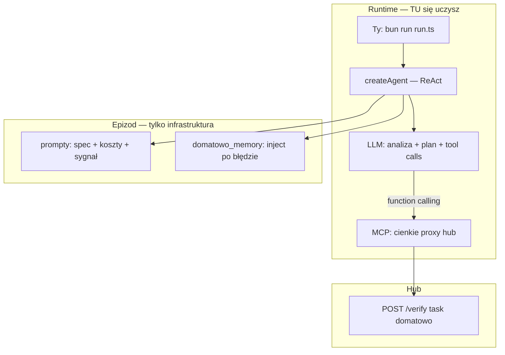

# S04E03 — domatowo (homework) — research

**Task:** Ocenić, czy zadanie domowe **`domatowo`** można rozwiązać z `@ai-devs/agent-boilerplate` tak, aby **agent AI (ReAct + function calling) sam** przeanalizował problem, zaplanował misję i wykonał ją przez narzędzia — **bez** wbudowanego solvera / planera w kodzie epizodu.

**Data:** 2026-06-23  
**Status:** Research v2 — **zaakceptowany** (2026-06-23); plan: [s04e03-domatowo.plan.md](s04e03-domatowo.plan.md)

**Powiązane:**

- [s04e03-contextual-collaboration.research.md](../../../boilerplate/docs/specs/s04e03-contextual-collaboration/s04e03-contextual-collaboration.research.md) — lekcja S04E03 (homework poza scope tam)
- [s03e02-firmware.research.md](../../../s03e02/docs/specs/s03e02-firmware/s03e02-firmware.research.md) — **wzorzec kanoniczny**: cienkie MCP + ReAct, inteligencja w modelu
- [savethem.research.md](../../../s03e05/docs/specs/savethem/savethem.research.md) — **antywzorzec** dla tego celu (`plan_route` = solver w MCP)
- [boilerplate-documentation.md](../../../docs/boilerplate-documentation.md) — §2.1, §2.2

**Źródła:**

- `markdowns/s04e03-kontekstowa-wspolpraca-z-ai-1774999647.md` — fabuła + spec API
- `tasks/boilerplate/` — ReAct, MCP, planning, retry
- Hub preview: https://hub.ag3nts.org/domatowo_preview
- **Probe API** (2026-06-23): `help`, `actionCost`, `getMap`, `searchSymbol`, `create`, `inspect`, `getLogs`

**Weryfikacja UI:** opcjonalny preview HTML (debug człowieka).

---

## 1. Executive summary

| Pytanie | Odpowiedź |
| --- | --- |
| **Czy da się rozwiązać `domatowo` agentem AI na boilerplate?** | **Tak** — to profil **`firmware`**: cienkie narzędzia MCP + pętla ReAct; model sam planuje i woła API. |
| **Czy Cursor / implementer może „zaszyć” rozwiązanie w TS?** | **Nie** — jeśli celem jest nauka. Solver (`planner`, `pathfind`, `plan_route`) **wykluczony** z deliverable. |
| **Co implementer buduje?** | **Infrastrukturę epizodu**: `createAgent`, prompty, MCP jako **proxy HTTP** do huba, memory po błędzie, retry — **zero logiki misji**. |
| **Kto rozwiązuje zadanie?** | **Model LLM** w runtime (`run.ts` → ReAct): analiza mapy, budżet 300 pkt, kolejność akcji, interpretacja logów PL. |
| **Czy to na pewno zadziała za pierwszym razem?** | **Nie gwarantowane** — budżet punktów i koszt 7 vs 1 to trudny test reasoning; wymaga dobrego modelu i promptu. To **świadoma cena edukacji**. |

**Rekomendowany profil epizodu:** **Agent-first (wariant E)** — wzorzec `tasks/s03e02/` (`firmware`): 4–8 wąskich narzędzi MCP + `enablePlanningPhase` + prompty z kontekstem zadania (koszty, sygnał radiowy, limity jednostek). **Żadnego** `domain/planner.ts`.

---

## 2. Granica: infrastruktura vs inteligencja (kluczowe dla scope)

Cel edukacyjny wymaga rozdzielenia **tego, co buduje developer epizodu**, od **tego, co robi agent w czasie uruchomienia**.

| Warstwa | Co wchodzi | Kto „myśli” | Przykład |
| --- | --- | --- | --- |
| **Boilerplate** | ReAct, adapter LLM, retry, logger | Runtime | `@ai-devs/agent-boilerplate` |
| **Infrastruktura epizodu** | MCP proxy, prompty, memory hooks, `run.ts` | Developer (Ty) — **bez strategii misji** | `domatowo_action({ action, ... })` → POST hub |
| **Inteligencja misji** | Analiza mapy, optymalizacja budżetu, trasy, inspekcja | **Agent AI w runtime** | Model po `getMap` decyduje o transporterze vs zwiadowcy |

### Dozwolone w kodzie epizodu (infrastruktura)

- Cienkie MCP: jedno wywołanie hub = jedno narzędzie (lub jeden generyczny `domatowo_action` z walidacją Zod `action`).
- Wstrzyknięcie `apikey` w handlerze — agent nie zarządza sekretami.
- `fetchWithRetry` / obsługa 503.
- Prompty `.md`: opis zadania, tabela kosztów, treść sygnału radiowy, lista dostępnych akcji — **jako kontekst**, nie gotowy plan krok po kroku z koordynatami.
- `domatowo_memory.ts`: po błędzie huba wstrzyknięcie „zaktualizuj plan” + `action_points_left` — jak `firmware_memory`.
- `enablePlanningPhase`: tura 0 — agent **sam** pisze plan przed pierwszym `create`/`move`.
- Testy **MCP** (czy proxy wysyła poprawny JSON) — **nie** testy optymalnej trasy.

### Zabronione w kodzie epizodu (solver = ucieczka od nauki)

| Element | Dlaczego wykluczyć |
| --- | --- |
| `planner.ts`, `pathfind.ts`, BFS/A* | Zastępuje reasoning modelu |
| MCP `plan_mission`, `plan_route`, `solve_domatowo` | Black box — jak `plan_route` w savethem, ale tu user **nie chce** solvera |
| Hardcoded lista pól B3 do inspekcji | Agent ma wynieść to z sygnału + `searchSymbol` |
| Regex auto-wykrywający partyzanta w logach | Agent ma **przeczytać** `getLogs` i zinterpretować PL |
| `run.ts` bez `createAgent` (pętla deterministyczna) | To rozwiązanie Cursora, nie agenta AI |
| Podpowiedzi w prompcie typu „idź na F1, G1…” | Gotowy algorytm — tylko ogólne reguły kosztów i mechaniki |

### Co agent AI musi zrobić sam (deliverable edukacyjny)

1. **Zrozumieć problem** — przeczytać spec (prompt), opcjonalnie `help` / `actionCost`.
2. **Wykorzystać kontekst** — sygnał radiowy → hipoteza „wysokie bloki” → `searchSymbol` / analiza `getMap`.
3. **Zaplanować misję** — tura 0 (`enablePlanningPhase`): jednostki, kolejność, szacunek punktów.
4. **Wykonać przez function calling** — `create`, `move`, `dismount`, `inspect`, `getLogs`, `callHelicopter`.
5. **Monitorować budżet** — reagować na `action_points_left` w odpowiedziach huba.
6. **Interpretować feedback** — logi inspekcji po polsku; ewentualnie `reset` i nowa próba po wyczerpaniu punktów.

---

## 3. Task Details — `domatowo` (kontekst dla agenta)

| Field | Value |
| --- | --- |
| Task ID | `domatowo` |
| Hub | `POST https://hub.ag3nts.org/verify` |
| Budżet | **300** punktów akcji |
| Jednostki | max 4 transportery, 8 zwiadowców |
| Mapa | 11×11 (A–K, 1–11) |
| Spawn | A6 → D6 |
| Sukces | `callHelicopter` na polu z potwierdzonym człowiekiem → `{FLG:...}` |

### Sygnał radiowy (metadata w prompcie — nie algorytm w TS)

> „Ukryłem się w jednym z **najwyższych bloków**…”

Agent ma **wywnioskować** priorytet przeszukania (np. symbol `B3`) — nie dostaje gotowej listy 14 pól w kodzie.

### Koszty (agent musi je respektować w planie)

| Akcja | Koszt |
| --- | --- |
| `create` scout | 5 |
| `create` transporter | 5 + 5 × pasażerów |
| `move` scout | 7 × pola |
| `move` transporter | 1 × pole (tylko ulice) |
| `inspect` | 1 |
| `dismount` | 0 |
| `getMap`, `searchSymbol`, `getLogs`, `help`, … | 0 |

### API (probe) — agent odkrywa przez narzędzia

Pełna lista akcji w `help`: `reset`, `create`, `move`, `inspect`, `dismount`, `getObjects`, `getMap`, `searchSymbol`, `getLogs`, `expenses`, `actionCost`, `callHelicopter`.

---

## 4. Werdykt: boilerplate + agent-first

### 4.1 Co boilerplate daje (wystarczające)

| Potrzeba | Mechanizm |
| --- | --- |
| Pętla ReAct + tool calling | `createAgent` |
| Plan przed działaniem | `enablePlanningPhase` |
| MCP | `createBoilerplateMcpServer` + epizodowe narzędzia |
| Retry HTTP | `fetchWithRetry` w handlerze MCP |
| Logi `[MYŚL]/[AKCJA]/[WYNIK]` | `logger.ts` |
| Flaga | `finish_task` po `{FLG:...}` w odpowiedzi |

### 4.2 Porównanie wariantów (z perspektywy użytkownika)

| Wariant | Kto rozwiązuje | Wartość edukacyjna | Zgodne z Twoim celem? |
| --- | --- | --- | --- |
| **A — Planer TS** | Kod | Niska — uczysz się algorytmów, nie agentów | ❌ |
| **B — Hybryda + solver w MCP** | Kod + udawany agent | Niska — jak savethem z `plan_route` | ❌ |
| **C — ReAct + wiele cienkich MCP** | **Model** | **Wysoka** | ✅ |
| **D — ReAct + `http_request`** | **Model** | Wysoka, ale gorsza abstrakcja | ⚠️ |
| **E — ReAct + domenowe MCP (firmware)** | **Model** | **Najwyższa** — wąskie narzędzia, jasne granice | **✅ Zalecany** |

**Werdykt:** wariant **E** — klon profilu **`firmware`**, nie `reactor` / `windpower` / `savethem` (solver).

---

## 5. Architektura epizodu (agent-first)



### Proponowane narzędzia MCP (cienkie — bez logiki misji)

Wzorzec **`firmware`**: jedna operacja = jedno HTTP, opis w `description` narzędzia.

| Narzędzie | Rola | Logika w handlerze |
| --- | --- | --- |
| `domatowo_help` | `action: help` | POST + retry |
| `domatowo_action_cost` | `action: actionCost` | POST + retry |
| `domatowo_get_map` | `action: getMap`, opcj. `symbols` | POST + retry |
| `domatowo_search_symbol` | `action: searchSymbol` | POST + retry |
| `domatowo_create` | `action: create` | POST + retry |
| `domatowo_move` | `action: move` | POST + retry |
| `domatowo_inspect` | `action: inspect` | POST + retry |
| `domatowo_dismount` | `action: dismount` | POST + retry |
| `domatowo_get_objects` | `action: getObjects` | POST + retry |
| `domatowo_get_logs` | `action: getLogs` | POST + retry |
| `domatowo_expenses` | `action: expenses` | POST + retry |
| `domatowo_call_helicopter` | `action: callHelicopter` | POST + retry |
| `domatowo_reset` | `action: reset` | POST + retry |

**Alternatywa:** jedno `domatowo_action` z `action` enum — mniej narzędzi w prompcie, więcej pracy modelu przy wyborze parametrów. Dla nauki **wiele wąskich narzędzi** (jak firmware: `shell_exec` + `submit`) jest czytelniejsze.

**Nie dodawać:** `submit_to_hub` jako osobny krok końcowy — każda akcja idzie przez ten sam kontrakt `answer: { action }`; flaga przychodzi w `message` po `callHelicopter`.

### Struktura katalogów (bez `domain/planner`)

```text
tasks/s04e03/
├── run.ts                    # createAgent + processQuery / pętla do flagi
├── index.ts
├── config.ts
├── package.json
├── src/
│   ├── mcp/
│   │   └── server.ts         # rejestracja cienkich narzędzi
│   ├── tools/mcp/
│   │   └── domatowo_*.ts     # proxy HTTP — każdy ~30–50 linii
│   ├── hub/
│   │   └── domatowoClient.ts # fetchWithRetry + buildBody (bez strategii)
│   ├── agent/
│   │   └── domatowo_memory.ts
│   └── prompts/
│       ├── system.md
│       └── domatowo_task.md  # spec, koszty, sygnał, antywzorce
└── docs/specs/s04e03-domatowo/
```

---

## 6. Projekt promptów (co agent dostaje, czego nie)

### `domatowo_task.md` — powinno zawierać

- Cel misji i warunek sukcesu (`callHelicopter`).
- Tabelę kosztów (z lekcji / `actionCost`).
- Treść sygnału radiowego (kontekst fabularny).
- Limity jednostek (4 / 8).
- Zasady ruchu: transporter tylko ulice; zwiadowca pieszo.
- Sekwencję **typową** (rozpoznanie → plan → create → move → dismount → inspect → logs → helicopter) — **bez** gotowych współrzędnych.
- Antywzorce: nie marnuj punktów na ruch zwiadowca na długich trasach; sprawdzaj `action_points_left`; czytaj `getLogs` po `inspect`.

### `system.md` — powinno zawierać

- Rola agenta ratunkowego.
- Zasada: **najpierw plan (tura 0), potem akcje**.
- Po każdej akcji hub: uwzględnij `action_points_left` w następnej decyzji.
- Interpretuj logi po polsku.
- `finish_task` dopiero po `{FLG:...}`.

### Czego prompty **nie** powinny zawierać

- Listy pól B3 do inspekcji.
- Gotowych tras transporterów.
- „Wywołaj `searchSymbol('B3')` jako krok 3” — agent ma dojść do tego sam.

---

## 7. Rekomendacje modeli LLM (agent-first, koszt ↔ jakość)

Przy **pełnym** rozwiązaniu przez agenta jakość modelu ma **bezpośredni** wpływ na sukces (w przeciwieństwie do wariantu z solverem).

### 7.1 Rekomendacja główna

| Model | Provider | Koszt (orient.) | Jakość dla domatowo | Werdykt |
| --- | --- | --- | --- | --- |
| **`anthropic/claude-sonnet-4-6`** | OpenRouter / Anthropic | Średni–wysoki | Najlepsze planowanie wieloetapowe, dobre tool calling, reasoning o kosztach 7 vs 1 | **✅ Rekomendowany** (jak `firmware` w research S03E02) |
| **`gpt-4o`** | OpenAI | Średni | Stabilny multi-step; lepszy niż mini przy mapie 11×11 | **✅ Alternatywa** |
| **`gpt-4o-mini`** | OpenAI | Niski | Może przejść przy dobrym prompcie; **często** przepala budżet 300 lub pomija `dismount` | **⚠️ Budżet / nauka** — OK na eksperymenty, słabszy na pierwszy sukces |
| **`gpt-4.1-mini`** | OpenAI | Niski–średni | Lepszy tool calling niż 4o-mini | **⚠️ Warto przetestować** |
| **Reasoning (`o3`, `o4-mini`, thinking)** | OpenAI / Anthropic | Wysoki | Pomaga przy planowaniu kosztów; uzasadnione jeśli Sonnet zawodzi | **⚠️ Eskalacja** po porażce mini |
| **Vision** | — | Wysoki | `getMap` zwraca JSON — vision zbędne | **❌** |

### 7.2 Strategia koszt ↔ jakość (praktyczna)

```text
1. Pierwszy run (nauka):  claude-sonnet-4-6 lub gpt-4o + enablePlanningPhase
2. Iteracja / debug:        ten sam model + Langfuse (śledź tury i tool calls)
3. Oszczędność po sukcesie: gpt-4o-mini — porównaj czy agent sam ogarnia
4. Porażka na budżecie:     reasoning_effort / mocniejszy model — NIE solver w TS
```

**Szacunek kosztu jednego runu (agent-first, sukces):**

| Model | Szacunek tur | Szacunek USD |
| --- | --- | --- |
| `gpt-4o-mini` | 25–50+ | $0.05–0.20 (często wiele prób) |
| `gpt-4o` | 15–35 | $0.15–0.60 |
| `claude-sonnet-4-6` | 12–30 | $0.20–0.80 |

To **świadomy koszt** edukacji — płacisz za trajektorię agenta, nie za 0-tokenowy skrypt.

### 7.3 Konfiguracja agenta

| Parametr | Wartość | Uzasadnienie |
| --- | --- | --- |
| `AGENT_MODEL` | `anthropic/claude-sonnet-4-6` lub `gpt-4o` | Planowanie + tool calling |
| `MAX_ITERATIONS` | **35–50** | Wiele akcji hub (nie 10–12 jak w prostych zadaniach) |
| `enablePlanningPhase` | **`true`** | Obowiązkowe — agent planuje przed `create` |
| `toolDiscovery` | `false` | ≤13 wąskich narzędzi — wszystkie w prompcie |
| OM | wyłączone | Jedna sesja misji |
| `domatowo_memory` | **tak** | Inject planu po błędzie / niskim `action_points_left` |

---

## 8. Ryzyka agent-first (uczciwie)

| Ryzyko | Objaw | Co robi **agent** (nie kod) | Mitigacja infrastrukturalna |
| --- | --- | --- | --- |
| Przepalenie 300 pkt | `action_points_left` < 0 | Uczy się na błędzie; `reset` + nowy plan | Prompt + memory inject |
| Zwiadowca zamiast transportera | Wysoki koszt ruchu | Model poprawia strategię | Tabela kosztów w prompcie |
| Zapomnienie `getLogs` po `inspect` | Brak helikoptera | Kolejna tura | Antywzorzec w prompcie |
| Złe `object` hash | Błąd API | `getObjects` | Opis narzędzia |
| Halucynacja współrzędnych | Błąd `move` | Korekta z odpowiedzi huba | — |
| Zbyt mało tur ReAct | Agent kończy przed flagą | — | `MAX_ITERATIONS` 35–50 |

**Wniosek edukacyjny:** porażki są **częścią curriculum** — dokładnie jak w lekcji S04E03 (systemy w tle też wymagają iteracji). Solver w TS usuwa tę warstwę nauki.

---

## 9. Powiązanie z lekcją S04E03

| Temat lekcji | Agent-first `domatowo` |
| --- | --- |
| **Kontekst w decyzji** | Sygnał radiowy w prompcie → agent zawęża hipotezę |
| **Dyscyplina zasobów** | 300 pkt — agent musi planować jak „nie spamować powiadomień” |
| **AI rozwiązuje problem** | Jedna sesja ReAct = jeden „agent ratunkowy” |
| Izolacja wielu agentów | Nie dotyczy — jeden agent, jedna misja |
| Solver w TS z lekcji produkcyjnej | **Świadomie odrzucony** na rzecz nauki agentów |

---

## 10. Gap analysis

| Element | Stan |
| --- | --- |
| `tasks/s04e03/` | **Brak** — scaffold agent-first po akceptacji planu |
| Wzorzec do skopiowania struktury | `tasks/s03e02/` (firmware) |
| Antywzorzec | `tasks/s03e03/` (reactor), `tasks/s04e02/` (orchestrator), `plan_route` w s03e05 |
| Research v1 (solver-first) | **Zastąpiony** tym dokumentem |

---

## 11. Otwarte pytania (do akceptacji)

| # | Pytanie | Propozycja (agent-first) |
| --- | --- | --- |
| 1 | Czy `createAgent` jest **wymagany**? | **Tak** — to core deliverable |
| 2 | Wiele MCP vs jedno `domatowo_action`? | **Wiele wąskich** (jak firmware) — czytelniejsza nauka function calling |
| 3 | Czy implementer może dodać solver „na boku”? | **Nie** w tym scope — osobny eksperyment poza epizodem |
| 4 | Czy E2E PASS jest DoD? | **Tak**, ale przez **agent run**, nie deterministyczny skrypt |
| 5 | Testy jednostkowe? | Tylko **MCP proxy** + ewent. `domatowoClient` — **bez** testów tras |
| 6 | Start od `reset`? | Agent woła `domatowo_reset` na początku (w prompcie jako sugestia, nie hardcode w `run.ts`) |

---

## 12. Następne kroki (po akceptacji)

1. **Human gate:** akceptacja research v2 (agent-first).
2. **Plan:** `s04e03-domatowo.plan.md` — scaffold jak `s03e02`, MCP proxy, prompty, memory, E2E agent run.
3. **Implementacja:** infrastruktura only — **bez** `planner` / `pathfind`.
4. **E2E:** `bun --env-file=../.env run run.ts` → obserwuj `[MYŚL]/[AKCJA]/[WYNIK]` → `{FLG:...}`.

---

## 13. Werdykt końcowy (odpowiedź na Twoje wymaganie)

**Czy da się tak zrobić na boilerplate?** — **Tak.** Profil to **`firmware`**, nie `reactor`.

**Czy Cursor ma „rozwiązać zadanie” w kodzie?** — **Nie.** Ma dostarczyć **szkielet agenta** (MCP + prompty + pętlę ReAct). Rozwiązanie misji = **praca LLM w runtime**, którą obserwujesz w logach.

**Jaki model?** — Do pierwszego sensownego sukcesu: **`claude-sonnet-4-6`** lub **`gpt-4o`**; `gpt-4o-mini` jako tańsza iteracja po zrozumieniu mechaniki.

**Co z poprzednim research v1 (solver TS)?** — To podejście **produkcyjne / optymalne pod flagę**, ale **sprzeczne z Twoim celem edukacyjnym**. W tym scope jest **jawnie wykluczone**.

---

## 14. Assumptions

- `HUB_API_KEY` w `tasks/.env`.
- Użytkownik akceptuje, że agent-first może wymagać **wielu uruchomień** i kosztu LLM.
- Pozycja partyzanta losowa przy `reset` — agent nie może polegać na zapamiętanej komórce z poprzedniego runu.
- Implementer (Cursor) nie dodaje solvera „dla pewności” — E2E PASS ma wynikać z trajektorii agenta.
