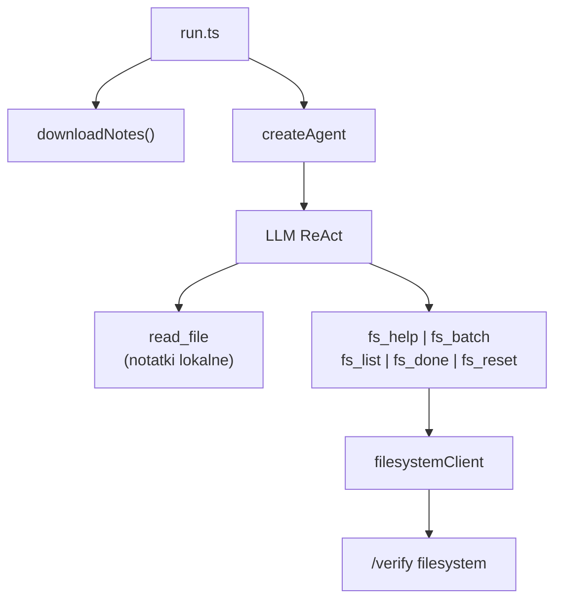

# Plan wdrożenia — S04E04 homework `filesystem` (agent + narzędzia)

**Normatywny research:** [filesystem.research.md](filesystem.research.md) — profil **agent-first** (wzorzec `domatowo` / `firmware`)  
**Workspace:** `tasks/s04e04/` (greenfield)  
**Status:** Plan — **czeka na akceptację** (zaktualizowany 2026-06-28 — korekta: agent rozwiązuje, plan dostarcza narzędzia)

**Wildly Important Goal**

**Goal:** Zbudować aplikację agentową `tasks/s04e04/`, która dostarcza **narzędzia i prompty** — a **agent LLM w runtime** (`bun run run.ts`) sam czyta notatki Natana, organizuje wiedzę w wirtualny FS i uzyskuje flagę.

**Success measure:** `bun test` + `tsc` PASS (tylko infrastruktura); manualnie agent zwraca `{FLG:...}`; **brak** parserów domenowych w repo.

**Do NOT touch / do NOT add:**

- `parseOgloszenia`, `parseTransakcje`, `parseRozmowy`, `buildFilesystem`, `normalize` domenowe
- `orchestrator.ts` bez `createAgent` (profil `windpower`)
- Gotowe encje (miasta/osoby/towary) w promptach lub kodzie
- Rozwiązanie zadania przez Cursor
- Zmiany `tasks/boilerplate/src/`

**Opis podejścia:** `run.ts` → `createAgent` + MCP (`fs_*`) + `read_file` + prompty. `downloadNotes.ts` tylko rozpakowuje ZIP. Mapowanie plik→FS = **praca agenta**.

**Decyzje:**

| # | Pytanie | Decyzja |
| --- | --- | --- |
| 1 | Kto rozwiązuje zadanie? | **Agent AI w runtime** |
| 2 | Co dostarcza implementacja? | **Narzędzia MCP + prompty + ingest ZIP** |
| 3 | Entrypoint | **`run.ts`** z `createAgent` (jeden) |
| 4 | Wzorzec epizodu | **`s04e03/domatowo`**, `s03e02/firmware` |
| 5 | Antywzorzec | Deterministyczny orchestrator (`s04e02/windpower`) |
| 6 | Batch vs pojedyncze create | Agent używa **`fs_batch`** (prompt) |
| 7 | `done` | Osobne narzędzie **`fs_done`**, nie w batch |
| 8 | Listowanie | **`listFiles`** w `fs_list` |
| 9 | Model domyślny | **`gpt-4o`** (`AGENT_MODEL` override); eskalacja: `anthropic/claude-sonnet-4-6` |
| 10 | `AGENT_MAX_OUTPUT_TOKENS` | **4096** (duży `fs_batch`) |
| 11 | `MAX_ITERATIONS` | **12–15** |

---

## Technical Context

| Obszar | Wartość |
| --- | --- |
| **Stack** | Bun, TypeScript, `zod`, `@ai-devs/agent-boilerplate`, MCP SDK |
| **Agent** | `createAgent`, `enablePlanningPhase: true`, `MAX_ITERATIONS` 12–15 |
| **Model** | Default **`gpt-4o`**; eskalacja **`anthropic/claude-sonnet-4-6`** — patrz research [§8](filesystem.research.md#8-rekomendacje-modeli-llm-agent-first-koszt--jakość) |
| **`AGENT_MAX_OUTPUT_TOKENS`** | **4096** (argument `fs_batch` może być długi) |
| **Env** | `OPENAI_API_KEY`, `HUB_API_KEY`, `AGENT_MODEL` (opcjonalnie), Langfuse opcjonalnie |
| **Wzorce** | `tasks/s04e03/run.ts`, `tasks/s03e02/run.ts`, `tasks/s04e01/run.ts` |
| **Testy** | `bun test`, `bunx tsc --noEmit` — **tylko** MCP/client/ingest |
| **Uruchomienie** | `bun --env-file=../.env run run.ts` |

---

## 1. Granica implementacji (normatywna)

### Dozwolone (infrastruktura)

- `filesystemClient.ts` — HTTP proxy
- `fs_*.ts` — cienkie MCP (Zod na shape, nie na treść merytoryczną)
- `downloadNotes.ts` — ZIP → folder
- `filesystem_task.md` — wymagania + wskazówki (research §4.2)
- `filesystem_memory.ts` — inject po błędzie hub
- Testy: czy MCP wysyła poprawny JSON do huba

### Zabronione (solver)

- Jakikolwiek kod ekstrahujący miasta/osoby/towary z txt
- MCP typu `extract_entities`, `build_batch_for_me`
- Prompty z listą 8 miast i gotowymi slugami
- `run.ts` bez wywołania `createAgent`

---

## 2. Architektura



### Narzędzia agenta (docelowe)

| Narzędzie | Input (Zod) | Handler |
| --- | --- | --- |
| `read_file` | path, offset?, limit? | boilerplate — ścieżki w `data/natan_notes/` |
| `fs_help` | `{}` | `{ action: "help" }` |
| `fs_batch` | `{ actions: FilesystemAction[] }` | POST tablica |
| `fs_done` | `{}` | `{ action: "done" }` + flag |
| `fs_list` | `{ path?: string }` | `{ action: "listFiles", path }` |
| `fs_reset` | `{}` | `{ action: "reset" }` |
| `finish_task` | native | po fladze |

### `FilesystemAction` (Zod — tylko shape)

```typescript
const filesystemActionSchema = z.discriminatedUnion("action", [
  z.object({ action: z.literal("createDirectory"), path: z.string() }),
  z.object({
    action: z.literal("createFile"),
    path: z.string(),
    content: z.string(),
  }),
  z.object({ action: z.literal("deleteFile"), path: z.string() }),
  z.object({ action: z.literal("deleteDirectory"), path: z.string() }),
  z.object({ action: z.literal("reset") }),
]);
```

**Zod nie waliduje** poprawności JSON miast ani linków — to ocenia hub przez agenta.

### Bootstrap `run.ts` (szkic)

```typescript
// 1. downloadNotes() → notesDir
// 2. createS04e04McpServer() + read_file z boilerplate MCP
// 3. createAgent({ instructions, tools, memory, enablePlanningPhase })
// 4. agent.processQuery(
//      "Uporządkuj notatki Natana. Notatki w: {notesDir}. fs_help → read → fs_batch → fs_done."
//    )
```

---

## 3. Zakres plików

```text
tasks/s04e04/
├── run.ts
├── config.ts
├── package.json
├── tsconfig.json
├── .gitignore
├── README.md
└── src/
    ├── hub/filesystemClient.ts
    ├── hub/types.ts
    ├── ingest/downloadNotes.ts
    ├── mcp/server.ts
    ├── tools/mcp/fs_help.ts
    ├── tools/mcp/fs_batch.ts
    ├── tools/mcp/fs_done.ts
    ├── tools/mcp/fs_list.ts
    ├── tools/mcp/fs_reset.ts
    ├── prompts/system.md
    ├── prompts/filesystem_task.md
    └── agent/filesystem_memory.ts
```

**Nie tworzyć:** `src/domain/`, `orchestrator.ts`, `run-agent.ts`.

---

## 3.1 Modele LLM (normatywne — research §8)

| Model | Rola |
| --- | --- |
| **`gpt-4o`** | Default w `config.ts` — optymalny koszt–jakość |
| **`anthropic/claude-sonnet-4-6`** | Eskalacja: błędy PL, linków MD, zły batch |
| **`gpt-4.1-mini` / `gpt-4o-mini`** | Po sukcesie — tańsze iteracje (mniej stabilne) |

**Szkic `config.ts`:**

```typescript
export const DEFAULT_AGENT_MODEL =
  process.env["AGENT_MODEL"]?.trim() ?? "gpt-4o";

export const FILESYSTEM_MAX_ITERATIONS = 15;

export const AGENT_MAX_OUTPUT_TOKENS = 4096;
```

**Manual E2E:** `AGENT_MODEL=gpt-4o bun --env-file=../.env run run.ts` — sukces zależy od modelu; kilka runów OK.

---

## 4. Fazy implementacji

### Faza 1 — Scaffold

**Verification:** `bunx tsc --noEmit`

| ID | Zadanie | DoD |
| --- | --- | --- |
| F1.1 | `package.json`, `tsconfig.json`, `config.ts` (`gpt-4o`, `MAX_ITERATIONS` 15, `AGENT_MAX_OUTPUT_TOKENS` 4096) | `bun install` OK |
| F1.2 | `.gitignore` (`data/`) | — |
| F1.3 | Stub `run.ts` z TODO createAgent | kompiluje się |

---

### Faza 2 — Hub client + ingest

**Verification:** `bun test src/hub src/ingest`

| ID | Zadanie | DoD |
| --- | --- | --- |
| F2.1 | `filesystemClient.ts` | reuse `executeSubmitToHub` |
| F2.2 | `downloadNotes.ts` | ZIP → folder, cache |
| F2.3 | Testy mock hub + ingest | `bun test` PASS |

---

### Faza 3 — MCP narzędzia (`fs_*`)

**Verification:** `bun test src/tools/mcp`

| ID | Zadanie | DoD |
| --- | --- | --- |
| F3.1 | `fs_help`, `fs_done`, `fs_list`, `fs_reset` | cienkie proxy |
| F3.2 | `fs_batch` + Zod `FilesystemAction[]` | odrzuca zły shape |
| F3.3 | `mcp/server.ts` — `createS04e04McpServer()` | rejestruje 5 narzędzi |
| F3.4 | Testy MCP (mock client) | PASS |

---

### Faza 4 — Agent + prompty

**Verification:** manual `bun run run.ts` → agent woła narzędzia (logi `[AKCJA]`)

| ID | Zadanie | DoD |
| --- | --- | --- |
| F4.1 | `prompts/system.md` | ogólne zasady ReAct |
| F4.2 | `prompts/filesystem_task.md` | wymagania lekcji + §4.2 research + ścieżki notatek |
| F4.3 | `filesystem_memory.ts` | recordHub po `fs_done`; inject po błędzie |
| F4.4 | `run.ts` pełny — `createAgent` + boilerplate `read_file` + episode MCP | **bez** solvera |
| F4.5 | `README.md` | „agent rozwiązuje; my dostarczamy narzędzia” + sekcja modeli (§8 research) |

**Treść `filesystem_task.md` (szkic sekcji):**

- Cel: `/miasta`, `/osoby`, `/towary`
- Źródła: `README.md` → trzy `.txt` w podanym katalogu
- Mapowanie ogólne (ogłoszenia→miasta, transakcje→towary, rozmowy→osoby) — **bez listy encji**
- Limity API z `fs_help`
- Używaj `fs_batch`; `fs_done` osobno; iteruj na błędach
- ASCII w nazwach i JSON

---

### Faza 5 — Weryfikacja agenta (manual)

**Verification:** agent zwraca `{FLG:...}`

| ID | Zadanie | DoD |
| --- | --- | --- |
| F5.1 | Uruchom `AGENT_MODEL=gpt-4o bun --env-file=../.env run run.ts` | flaga (Ty, nie Cursor) |
| F5.2 | Preview HTML | struktura sensowna |
| F5.3 | Code review — **brak parserów** w diff | checklist §1 |

Jeśli agent fail — popraw **prompt** lub **opis narzędzi**, nie dodawaj parserów TS.

---

## 5. Kryteria akceptacji

- [x] `run.ts` używa `createAgent`
- [x] Agent ma: `read_file`, `fs_help`, `fs_batch`, `fs_done`, `fs_list`, `finish_task`
- [x] Brak plików `parse*.ts`, `buildFilesystem.ts`, `orchestrator.ts`
- [x] Prompty **nie** zawierają gotowego rozwiązania
- [x] `bun test` — infrastruktura PASS
- [ ] Manual: agent uzyskuje flagę
- [x] Zero zmian w `tasks/boilerplate/src/`

---

## 6. Ryzyka

| Ryzyko | Mitygacja |
| --- | --- |
| Implementer dodaje parsery „tymczasowo” | Review + zabronione w planie §1 |
| Agent robi wiele pojedynczych create | Prompt: wymuś `fs_batch` |
| Słaby model nie domyka zadania | Default `gpt-4o`; eskalacja Sonnet (research §8) |

---

## 7. Human gate

**Przed implementacją:** akceptacja skorygowanego research + planu.

**Po F4:** implementer **nie** uruchamia zadania za agenta — dostarcza tylko narzędzia.

**Po F5:** **Ty** uruchamiasz agenta i oceniasz flagę.

---

## Changelog

| Data | Zmiana |
| --- | --- |
| 2026-06-28 | Plan początkowy (błędnie: orchestrator deterministyczny) |
| 2026-06-28 | **Korekta:** agent-first; research/plan = narzędzia; solver wyłączony z kodu |
| 2026-06-28 | Dodano rekomendację modeli (research §8, plan §3.1) — default `gpt-4o` |
| 2026-06-28 | Implementacja F1–F4: agent-first runtime, MCP, testy, README |
