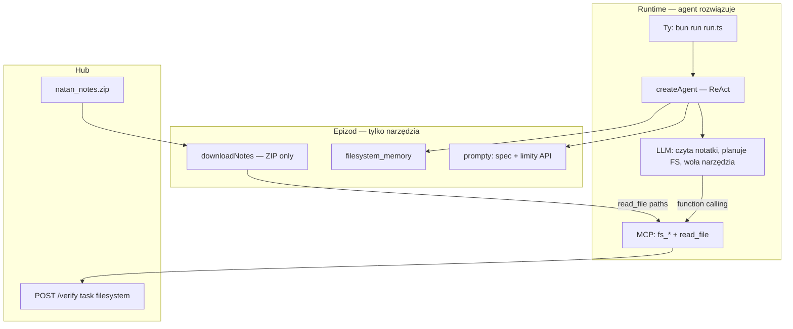

# S04E04 — homework `filesystem` (notatki Natana) — research

**Task:** Przeanalizować zadanie domowe **`filesystem`** z lekcji S04E04 oraz zaprojektować **osobną aplikację agentową** w `tasks/s04e04/` na bazie `@ai-devs/agent-boilerplate`. Research/plan dostarcza **wyłącznie infrastrukturę i narzędzia** (MCP, prompty, ingest ZIP). **Rozwiązanie zadania** (ekstrakcja encji z notatek, mapowanie na `/miasta`, `/osoby`, `/towary`, batch, flaga) należy do **agenta AI w runtime** — nie do Cursora, nie do parserów TS w kodzie epizodu.

**Data:** 2026-06-28  
**Status:** Research — **czeka na akceptację**  
**Plan (po akceptacji):** [filesystem.plan.md](filesystem.plan.md)

**Powiązane (lekcja, nie homework):**

- [s04e04-knowledge-base.research.md](../../../boilerplate/docs/specs/s04e04-knowledge-base/s04e04-knowledge-base.research.md) — vault markdown, `04_04_system`; homework **poza** werdyktem rozszerzeń pakietu
- [boilerplate-documentation.md](../../../docs/boilerplate-documentation.md) — §2.8 (wiersz `filesystem`: `http_request` + batch / TS)
- [s04e03-domatowo.research.md](../../s04e03/docs/specs/s04e03-domatowo/s04e03-domatowo.research.md) — **wzorzec kanoniczny**: cienkie MCP + ReAct, inteligencja w modelu
- [s03e02-firmware](../../s03e02/) — ten sam profil hub (proxy MCP, zero solvera)
- [s04e02-windpower.research.md](../../s04e02/docs/specs/s04e02-windpower/s04e02-windpower.research.md) — **antywzorzec** dla tego celu (deterministyczny orchestrator bez agenta)
- [savethem.research.md](../../s03e05/docs/specs/savethem/savethem.research.md) — **antywzorzec** `plan_route` (solver w MCP zastępuje reasoning modelu)

**Źródła:**

- `markdowns/s04e04-projektowanie-wlasnej-bazy-wiedzy-dla-ai-1775085192.md` — fabuła + spec zadania (`published_at: 2026-04-02`)
- `tasks/boilerplate/` — ReAct, MCP, `submit_to_hub`, `http_request`, `read_file`, retry
- **Probe API** (2026-06-28): `POST https://hub.ag3nts.org/verify`, `task: filesystem`, `answer.action: help|done|listFiles`
- **Probe danych** (2026-06-28): [natan_notes.zip](https://hub.ag3nts.org/dane/natan_notes.zip) — 4 pliki źródłowe + README
- Preview FS: https://hub.ag3nts.org/filesystem_preview.html

**Weryfikacja UI:** opcjonalny preview HTML (debug człowieka po `batch_mode`).

**Scope wyłączony z implementacji w tym wątku:** rozwiązanie zadania przez Cursor (chat lub hardcoded parsery); zmiany w `tasks/boilerplate/src/`; solver / `parseOgloszenia` / `buildFilesystem` w kodzie epizodu.

---

## 0. Kontekst lekcji vs zadanie domowe

### 0.1 Lekcja S04E04 (baza wiedzy)

Lekcja uczy projektowania **własnej bazy wiedzy** (vault markdown: Me / World / Craft / Ops / System), szablonów, procesów w `ops/` oraz balansu: człowiek = treść, AI = organizacja. Referencja runtime: `lessons/04_04_system/` — **nie** `@ai-devs/agent-boilerplate`.

### 0.2 Zadanie domowe `filesystem` (inny profil)

Homework to **jednorazowa transformacja** chaotycznych notatek tekstowych → **uporządkowany wirtualny system plików** na hubie. To nie jest trwały vault ani multi-agent KB — to epizod **hub + zdalny FS API**, opisany w §2.8:

```text
Zdalny FS / jednorazowa strukturyzacja danych (filesystem) → http_request + kod epizodu — nie moduł KB w pakiecie.
```

**Fabuła:** Natan Rams (handel wymienny między miastami) zostawił notatki; elektrownia potrzebuje struktury: miasta (zapotrzebowanie), osoby (handlowcy), towary (oferta).

### 0.3 Granica: infrastruktura vs inteligencja (normatywne)

Wzorzec jak [domatowo §2](../../s04e03/docs/specs/s04e03-domatowo/s04e03-domatowo.research.md):

| Warstwa | Co wchodzi | Kto „myśli” |
| --- | --- | --- |
| **Cursor / research / plan** | Spec narzędzi, prompty, kontrakt MCP, ingest ZIP | **Nie** — zero mapowania encji, zero flagi |
| **Implementer epizodu** | `createAgent`, MCP proxy hub, prompty `.md`, `run.ts`, testy MCP | **Nie** — zero `parseOgloszenia`, zero `buildFilesystem` |
| **Agent AI (runtime)** | Czyta notatki, planuje strukturę FS, woła narzędzia, iteruje na `done` | **Tak** — tu jest rozwiązanie zadania |
| **Boilerplate** | ReAct, adapter, retry, `read_file`, logger | Runtime |

**Deliverable research/plan:** aplikacja z **odpowiednimi narzędziami**, tak aby agent po `bun run run.ts` **sam** dotarł do flagi.

---

## 1. Executive summary

| Pytanie | Odpowiedź |
| --- | --- |
| **Czy da się zbudować aplikację na boilerplate?** | **Tak** — `createAgent` + cienkie MCP + `read_file` + prompty |
| **Kto rozwiązuje zadanie?** | **Agent LLM w runtime** — czyta notatki Natana, buduje FS przez narzędzia |
| **Co dostarcza research/plan?** | **Narzędzia i infrastrukturę** — nie algorytm ekstrakcji w TS |
| **Rekomendowany profil** | **Agent-first** (jak `domatowo` / `firmware`) — cienkie MCP proxy → hub |
| **Motyw lekcji S04E04** | Agent **organizuje wiedzę** (notatki → drzewo plików) — jak KB, ale zapis na zdalny FS |
| **Główna trudność agenta** | NL w `rozmowy.txt`, normalizacja PL→ASCII, kolejność linków MD, iteracja na błędach `done` |
| **Model (koszt–jakość)** | Default **`gpt-4o`**; eskalacja **`claude-sonnet-4-6`** — patrz [§8](#8-rekomendacje-modeli-llm-agent-first-koszt--jakość) |

**Werdykt:** epizod `tasks/s04e04/` = **host agenta** z narzędziami filesystem + odczyt notatek. **Nie** deterministyczny orchestrator z parserami (to byłoby rozwiązaniem Cursora w kodzie, nie agenta).

---

## 2. Treść zadania (wymagania)

### 2.1 Cel

Uporządkować notatki Natana w **wirtualnym filesystemie** hub tak, aby Centrala mogła odpowiedzieć na pytania:

- które **miasta** brały udział w handlu,
- które **osoby** odpowiadają za handel w danym mieście,
- które **towary** są przez kogo sprzedawane.

### 2.2 Struktura docelowa FS

| Katalog | Zawartość plików | Format treści |
| --- | --- | --- |
| `/miasta` | Jeden plik na miasto (nazwa = **mianownik** miasta, bez polskich znaków) | **JSON**: mapa `{ towar: ilość }` — zapotrzebowanie miasta, **bez jednostek** |
| `/osoby` | Pliki o handlowcach (nazwa pliku dowolna; zalecane `Imie_Nazwisko`) | Markdown: imię i nazwisko + **link MD** do pliku miasta, którym osoba zarządza |
| `/towary` | Jeden plik na towar w **mianowniku liczby pojedynczej** (np. `koparka`, nie `koparki`) | Markdown: link MD do miasta **oferującego** ten towar |

**Ograniczenia (lekcja):**

- Brak polskich znaków w **nazwach plików** i w **tekstach JSON**.
- Linki markdown muszą wskazywać **istniejące** pliki (reguła API — patrz §3).

### 2.3 API hub

| Pole | Wartość |
| --- | --- |
| Endpoint | `POST https://hub.ag3nts.org/verify` |
| `task` | `filesystem` |
| `apikey` | `HUB_API_KEY` z `tasks/.env` |
| Dane wejściowe | https://hub.ag3nts.org/dane/natan_notes.zip |
| Preview | https://hub.ag3nts.org/filesystem_preview.html |

**Flow operacyjny:**

1. `help` — manual API (limity, akcje, batch).
2. Opcjonalnie `reset` — czyści FS (dev / retry).
3. `createDirectory` + `createFile` (pojedynczo lub **`batch_mode`**).
4. `listFiles` — inspekcja (debug).
5. `done` — walidacja końcowa → `{FLG:...}` lub komunikat błędu.

**Batch mode (lekcja):** `answer` jako **tablica** akcji wykonywanych sekwencyjnie — pozwala utworzyć cały FS jednym requestem.

---

## 3. Kontrakt API (potwierdzony probe 2026-06-28)

### 3.1 Request bazowy

```json
{
  "apikey": "<HUB_API_KEY>",
  "task": "filesystem",
  "answer": { "action": "help" }
}
```

### 3.2 Limity i reguły (`help`)

| Reguła | Wartość |
| --- | --- |
| `max_directory_name_length` | 30 |
| `max_file_name_length` | 20 |
| `max_directory_depth` | 3 |
| `allowed_name_pattern` | `^[a-z0-9_]+$` |
| `global_unique_names` | **true** — segment nazwy pliku unikalny w całym FS |
| Treść `createFile` | Tylko składnia **markdown** |
| Linki w treści | Muszą wskazywać **istniejące** pliki |

**Uwaga:** w transkrypcie lekcji pada `listDir`; API zwraca akcję **`listFiles`** (nie `listDir`).

### 3.3 Akcje

| Akcja | Parametry | Uwagi |
| --- | --- | --- |
| `createDirectory` | `path` | Np. `/miasta` |
| `createFile` | `path`, `content` | Nadpisuje istniejący plik |
| `deleteFile` | `path` | — |
| `deleteDirectory` | `path` | Rekursywnie |
| `listFiles` | `path?` (domyślnie `/`) | Lista plików z metadanymi |
| `reset` | — | Czyści cały FS |
| `done` | — | Walidacja zadania |
| `help` | — | Manual |

### 3.4 Batch mode

| Dozwolone w batch | **Niedozwolone** w batch |
| --- | --- |
| `createFile`, `createDirectory`, `deleteFile`, `deleteDirectory`, `reset` | `done`, `help`, `listFiles` |

Przykład:

```json
{
  "apikey": "<HUB_API_KEY>",
  "task": "filesystem",
  "answer": [
    { "action": "createDirectory", "path": "/miasta" },
    { "action": "createFile", "path": "/miasta/domatowo", "content": "{\"makaron\": 60}" }
  ]
}
```

**`done` zawsze osobno** — po udanym batchu.

### 3.5 Przykładowe odpowiedzi walidacji

| Wywołanie | Wynik (probe) |
| --- | --- |
| `done` na pustym FS | `code: -845`, *Required directories /miasta and /osoby are missing.* |
| `listFiles` `/` | `entries: []` na świeżym koncie |

Implementacja powinna traktować komunikaty `done` jak **testy akceptacyjne** (wzorzec `okoeditor` / `drone`): iteruj batch → `done` → popraw model.

---

## 4. Dane źródłowe (natan_notes.zip) — kontekst **dla agenta**, nie dla parserów TS

### 4.1 Pliki w archiwum (agent czyta przez `read_file`)

| Plik | Opis (README w ZIP) | Docelowy katalog FS (agent wnioskuje) |
| --- | --- | --- |
| `ogłoszenia.txt` | Zapotrzebowanie miast | **`/miasta`** — JSON demand |
| `transakcje.txt` | Kto komu co sprzedał | **`/towary`** — link do miasta sprzedającego |
| `rozmowy.txt` | Dziennik rozmów Natana | **`/osoby`** — handlowiec + link do miasta |
| `README.md` | Opis ról plików | Meta — pierwszy plik do przeczytania |

**Implementer:** tylko `downloadNotes.ts` rozpakowuje ZIP do `data/natan_notes/`. **Nie** implementuje mapowania plik→katalog w kodzie.

### 4.2 Wskazówki w prompcie (nie algorytm w TS)

Te reguły trafiają do `filesystem_task.md` — **agent** je stosuje:

| Obszar | Wskazówka dla agenta |
| --- | --- |
| `/miasta` | Szukaj zapotrzebowania w `ogłoszenia.txt`; JSON `{ towar: liczba }`, bez jednostek, ASCII |
| `/towary` | W `transakcje.txt` miasto **po lewej** sprzedaje → link do `/miasta/{slug}` |
| `/osoby` | W `rozmowy.txt` kto zarządza handlem w którym mieście → link MD do miasta |
| Nazwy plików | Mianownik, `^[a-z0-9_]+$`, max 20 znaków, bez polskich znaków |
| JSON w miastach | Bez polskich znaków w kluczach |
| Kolejność | Najpierw katalogi + pliki miast, potem osoby/towary z linkami |
| Batch | Preferuj `fs_batch` z wieloma akcjami; `done` osobno |
| API | Wołaj `fs_help` na start; `fs_list` do weryfikacji; iteruj na komunikatach `fs_done` |

**Zabronione w prompcie:** gotowa lista 8 miast, 8 osób, 17 towarów z poprawnymi slugami — to byłoby rozwiązaniem w research.

### 4.3 Przykładowe wzorce w danych (agent musi je **sam** odkryć)

Fragmenty ilustrują **trudność zadania** — nie specyfikację parsera:

- `ogłoszenia.txt`: *„Do Domatowa … 60 makaronu, 150 butelek wody i 8 lopat”* → agent: miasto + pary towar/ilość.
- `transakcje.txt`: *`Domatowo -> chleb -> Opalino`* → agent: `/towary/chleb` → link Domatowo.
- `rozmowy.txt`: *„z Opalina dzwonila Iga Kapecka”* → agent: osoba ↔ Opalino.

Pułapki dla agenta: odmiana miast, literówki (`jezo` zamiast kurczak), `listFiles` vs `listDir` z lekcji, `global_unique_names`.

---

## 5. Mapowanie na `@ai-devs/agent-boilerplate`

### 5.1 Co reuse bez zmian w pakiecie (rdzeń agenta)

| Komponent | Rola w `filesystem` |
| --- | --- |
| `createAgent` + ReAct | **Główna pętla** — agent rozwiązuje zadanie |
| `read_file` | Agent czyta rozpakowane notatki (`data/natan_notes/`) |
| `enablePlanningPhase` | Tura 0: plan (help → read notes → batch → done) |
| `finish_task` | Po `{FLG:...}` z `fs_done` |
| `executeSubmitToHub` / `fetchWithRetry` | W handlerach MCP epizodu |
| `extractFlag` | W `fs_done` handler |
| `MemoryHooks` | Inject po błędzie `done` — jak `domatowo_memory` |

### 5.2 Dozwolone w kodzie epizodu (infrastruktura / narzędzia)

- Cienkie MCP: `fs_help`, `fs_batch`, `fs_done`, `fs_list`, opcjonalnie `fs_reset` — każde = POST hub + Zod.
- `filesystemClient.ts` — wspólny klient HTTP (używany przez MCP).
- `downloadNotes.ts` — pobierz/rozpakuj ZIP **bez** parsowania treści.
- Prompty `.md` — wymagania zadania, limity API, wskazówki mapowania (§4.2), **bez** gotowych encji.
- `filesystem_memory.ts` — po błędzie `done`: wstrzyknij komunikat huba + prośba o korektę.
- Testy **MCP** (czy proxy wysyła poprawny JSON) — **nie** testy poprawności mapowania miast/osób.

### 5.3 Zabronione w kodzie epizodu (solver = Cursor w TS)

| Element | Dlaczego |
| --- | --- |
| `parseOgloszenia.ts`, `parseTransakcje.ts`, `parseRozmowy.ts` | Zastępuje reasoning agenta |
| `buildFilesystem.ts`, `normalize.ts` domenowe | Generator rozwiązania w kodzie |
| `orchestrator.ts` bez `createAgent` | Profil `windpower` — nie ten homework |
| MCP `solve_filesystem`, `extract_entities` | Black box solver |
| Hardcoded lista miast/osób/towarów | Rozwiązanie w research/implementacji |
| Prompty z gotowymi slugami i JSON | Gotowy algorytm zamiast organizacji przez agenta |

### 5.4 Zgodność z §2.8

Agent powinien używać **`fs_batch`** (batch_mode), nie dziesiątek pojedynczych `createFile` w osobnych turach. Narzędzie batch to **infrastruktura**; **zawartość** tablicy akcji pochodzi z agenta.

---

## 6. Architektura agent-first (jedyny wariant docelowy)

### 6.1 Diagram



### 6.2 Co agent robi sam w runtime

1. **`fs_help`** — poznaje limity i akcje (`listFiles`, batch rules).
2. **`read_file`** — czyta `README.md`, potem `ogłoszenia.txt`, `transakcje.txt`, `rozmowy.txt`.
3. **Tura 0 (plan)** — wypisuje plan: jakie miasta/osoby/towary, kolejność batch, normalizacja ASCII.
4. **`fs_batch`** — wysyła tablicę `createDirectory` + `createFile` (miasta → osoby → towary).
5. **`fs_list`** — opcjonalnie weryfikuje strukturę.
6. **`fs_done`** — czyta błąd lub flagę; przy błędzie **`fs_reset`** + poprawka + ponowny batch.
7. **`finish_task`** — po `{FLG:...}`.

### 6.3 Narzędzia MCP (deliverable research/plan)

| Narzędzie | Odpowiednik API | Logika w handlerze |
| --- | --- | --- |
| `fs_help` | `{ action: "help" }` | POST + retry |
| `fs_batch` | `answer: FilesystemAction[]` | POST + walidacja Zod (shape akcji, nie treści merytorycznej) |
| `fs_done` | `{ action: "done" }` | POST + `extractFlag` |
| `fs_list` | `{ action: "listFiles", path? }` | POST |
| `fs_reset` | `{ action: "reset" }` | POST (dev / retry) |
| `read_file` | lokalny odczyt | z boilerplate MCP — ścieżki pod `data/natan_notes/` |
| `finish_task` | native | z boilerplate |

**Alternatywa odrzucona:** jedno `fs_action({ action, ... })` — możliwe, ale wiele wąskich narzędzi (jak `firmware`) jest czytelniejsze dla agenta.

**Nie dodawać:** `submit_to_hub` jako osobne narzędzie agenta — epizodowe `fs_*` wystarczą (wzorzec `domatowo`).

---

## 7. Proponowana struktura aplikacji `tasks/s04e04/`

```text
tasks/s04e04/
├── run.ts                          # createAgent + MCP (JEDYNY entrypoint)
├── config.ts                       # model, MAX_ITERATIONS, NOTES_DIR, paths
├── package.json
├── tsconfig.json
├── .gitignore                      # data/
├── README.md
├── docs/specs/filesystem/
│   ├── filesystem.research.md
│   └── filesystem.plan.md
└── src/
    ├── hub/
    │   ├── filesystemClient.ts     # cienki klient — używany przez MCP
    │   └── types.ts                # FilesystemAction (Zod), HubResponse
    ├── ingest/
    │   └── downloadNotes.ts        # ZIP → katalog; BEZ parserów
    ├── mcp/
    │   └── server.ts               # createS04e04McpServer()
    ├── tools/mcp/
    │   ├── fs_help.ts
    │   ├── fs_batch.ts
    │   ├── fs_done.ts
    │   ├── fs_list.ts
    │   └── fs_reset.ts
    ├── prompts/
    │   ├── system.md
    │   └── filesystem_task.md      # wymagania + wskazówki §4.2
    └── agent/
        └── filesystem_memory.ts    # inject po błędzie fs_done
```

**Brak w repo:** `domain/parse*.ts`, `buildFilesystem.ts`, `orchestrator.ts`.

### 7.1 Odpowiedzialność modułów

| Moduł | Odpowiedzialność |
| --- | --- |
| `downloadNotes.ts` | Pobranie/rozpakowanie ZIP; zwraca ścieżkę katalogu |
| `filesystemClient.ts` | HTTP proxy do huba |
| `fs_*.ts` | Jedno narzędzie = jedno wywołanie client; Zod na **kształt** requestu |
| `filesystem_task.md` | Kontekst zadania dla agenta (nie rozwiązanie) |
| `filesystem_memory.ts` | Po błędzie: „hub said X — popraw batch” |
| `run.ts` | Bootstrap: downloadNotes → createAgent → `processQuery` |

### 7.2 Kolejność w batch (agent musi to respektować — opis w prompcie)

```text
1. createDirectory /miasta, /osoby, /towary
2. createFile /miasta/*  (najpierw — linki MD wymagają istniejących plików)
3. createFile /osoby/*
4. createFile /towary/*
5. fs_done (osobne wywołanie, nie w batch)
```

---

## 8. Rekomendacje modeli LLM (agent-first, koszt ↔ jakość)

Przy **pełnym** rozwiązaniu przez agenta jakość modelu wpływa na sukces bezpośrednio — szczególnie przy polskim NL w `rozmowy.txt` i jednym dużym argumencie `fs_batch`.

### 8.1 Profil zadania a wybór modelu

| Cecha | Wpływ |
| --- | --- |
| 4 małe pliki txt | Niski koszt wejścia |
| Polski NL + odmiana | Modele mocniejsze od mini |
| Jeden duży `fs_batch` (wiele `createFile`) | Tool calling + poprawny JSON w argumencie |
| ~6–15 tur ReAct | Znacznie mniej niż `domatowo` (25–50+) |
| Iteracja na błędach `fs_done` | Umiarkowany reasoning |

### 8.2 Tabela modeli

| Model | Provider | Koszt (orient.) | Jakość dla `filesystem` | Werdykt |
| --- | --- | --- | --- | --- |
| **`gpt-4o`** | OpenAI | Średni | Stabilny tool calling, sensowny PL, wystarczający reasoning | **✅ Optymalny sweet spot** — default w `config.ts` |
| **`anthropic/claude-sonnet-4-6`** | OpenRouter / Anthropic | Wyższy | Bardzo dobry plan + NL; wzorzec `domatowo` / `firmware` | **✅ Eskalacja** gdy `gpt-4o` myli osoby/miasta lub psuje batch |
| **`gpt-4.1-mini`** | OpenAI | Niski–średni | Lepszy tool calling niż `4o-mini` | **⚠️ Warto przetestować** po pierwszym sukcesie |
| **`gpt-4o-mini`** | OpenAI | Niski | Może przejść (default `okoeditor`); ryzyko przy PL i dużym batchu | **⚠️ Eksperyment / oszczędność** |
| **`o3` / reasoning (thinking)** | OpenAI / Anthropic | Wysoki | Overkill dla ekstrakcji + batch | **⚠️ Eskalacja** po porażkach mini |
| **Vision** | — | — | Notatki to txt — zbędne | **❌** |

### 8.3 Strategia koszt ↔ jakość (praktyczna)

```text
1. Pierwszy sensowny run:     gpt-4o + enablePlanningPhase
2. Problemy z PL / linkami:   anthropic/claude-sonnet-4-6
3. Po sukcesie — taniej:      gpt-4.1-mini → gpt-4o-mini
4. Porażka:                   mocniejszy model / lepszy prompt — NIE parser w TS
```

**Szacunek kosztu jednego runu (agent, sukces):**

| Model | Szacunek tur | Szacunek USD |
| --- | --- | --- |
| `gpt-4o-mini` | 10–25 (często retry) | ~$0.03–0.15 |
| **`gpt-4o`** | **6–15** | **~$0.08–0.35** |
| `claude-sonnet-4-6` | 6–12 | ~$0.15–0.50 |

Główny koszt to **jedna tura z dużym argumentem `fs_batch`**, nie dziesiątki tur jak w `domatowo`.

### 8.4 Konfiguracja agenta (propozycja epizodu)

| Parametr | Wartość | Uzasadnienie |
| --- | --- | --- |
| `AGENT_MODEL` | `gpt-4o` (override env) | Sweet spot koszt–jakość |
| `FILESYSTEM_MAX_ITERATIONS` | **12–15** | Wystarczy; nie 40 jak domatowo |
| `AGENT_MAX_OUTPUT_TOKENS` | **4096** | Batch z wieloma `createFile` — wyżej niż domatowo (512) |
| `enablePlanningPhase` | **`true`** | Plan przed `fs_batch` |
| `toolDiscovery` | `false` | Wąski zestaw narzędzi w prompcie |
| OM | wyłączone | Jedna sesja, krótki kontekst |
| `filesystem_memory` | **tak** | Inject po błędzie `fs_done` |

**Przykład `tasks/.env`:**

```bash
AGENT_MODEL=gpt-4o
# eskalacja:
# AGENT_MODEL=anthropic/claude-sonnet-4-6
```

**Powiązane:** [domatowo research §7](../../s04e03/docs/specs/s04e03-domatowo/s04e03-domatowo.research.md) · [§2.1 boilerplate-documentation](../../../docs/boilerplate-documentation.md#21-project-constraints-s03e02)

---

## 9. Testowanie i kryteria sukcesu

### 9.1 Testy implementera (infrastruktura)

| Test | Co sprawdza |
| --- | --- |
| `filesystemClient.test.ts` | Mock hub — batch array shape |
| `fs_batch.test.ts` | Zod odrzuca zły shape akcji |
| `downloadNotes.test.ts` | Cache / rozpakowanie (mock fetch) |

**Nie testuj:** poprawności mapowania Domatowo→makaron — to wynik agenta, nie kodu.

### 9.2 Sukces end-to-end (agent)

```bash
cd tasks/s04e04
bun --env-file=../.env run run.ts
# Agent w pętli ReAct → {FLG:...}
```

Wymaga `OPENAI_API_KEY` (+ `HUB_API_KEY`). Flaga = dowód, że **agent** rozwiązał zadanie.

### 9.3 Definition of Done epizodu

- [ ] `run.ts` używa `createAgent` — **bez** deterministycznego solvera
- [ ] Agent ma `read_file` + `fs_*` + `finish_task`
- [ ] Prompty opisują zadanie, **nie** zawierają gotowego rozwiązania
- [ ] `bun test` — tylko MCP/client/ingest
- [ ] Manual: agent uzyskuje flagę
- [ ] Zero zmian w `tasks/boilerplate/src/`

---

## 10. Ryzyka

| # | Ryzyko | Mitygacja |
| --- | --- | --- |
| 1 | Agent robi 30× pojedynczy createFile | Prompt + `fs_batch`; limit iteracji |
| 2 | Agent nie czyta wszystkich plików | Prompt: najpierw README, potem 3 txt |
| 3 | Błąd `done` — agent się gubi | `filesystem_memory` + dozwolony `fs_reset` |
| 4 | Implementer „pomaga” parserami | Plan §3 zabrania; review checklist |
| 5 | Koszt tokenów (duży batch w argumencie) | Akceptowalne — jeden batch vs 30 tur |
| 6 | Słaby model nie domyka zadania | Dobry model w `config.ts`; planning phase |

---

## 11. Werdykt końcowy

**Research/plan dostarcza narzędzia; agent AI rozwiązuje zadanie.**

- **Tak** — aplikacja na `@ai-devs/agent-boilerplate` z profilem **`domatowo` / `firmware`**.
- **Deliverable:** MCP `fs_*`, `read_file`, prompty, ingest ZIP, `run.ts` z `createAgent`.
- **Nie deliverable:** parsery, builder, orchestrator deterministyczny, rozwiązanie w Cursor.
- **Flaga** pojawia się dopiero gdy **uruchomisz agenta** — nie gdy implementer kończy kod.

**Następny krok:** akceptacja research → [filesystem.plan.md](filesystem.plan.md) → implementacja **tylko narzędzi**.

---

## 12. Assumptions

- API hub z probe 2026-06-28 reprezentatywne.
- ZIP stabilny między pobraniami.
- `OPENAI_API_KEY` + `HUB_API_KEY` w `tasks/.env`.
- Użytkownik akceptuje profil agent-first (nie deterministyczny skrypt).
