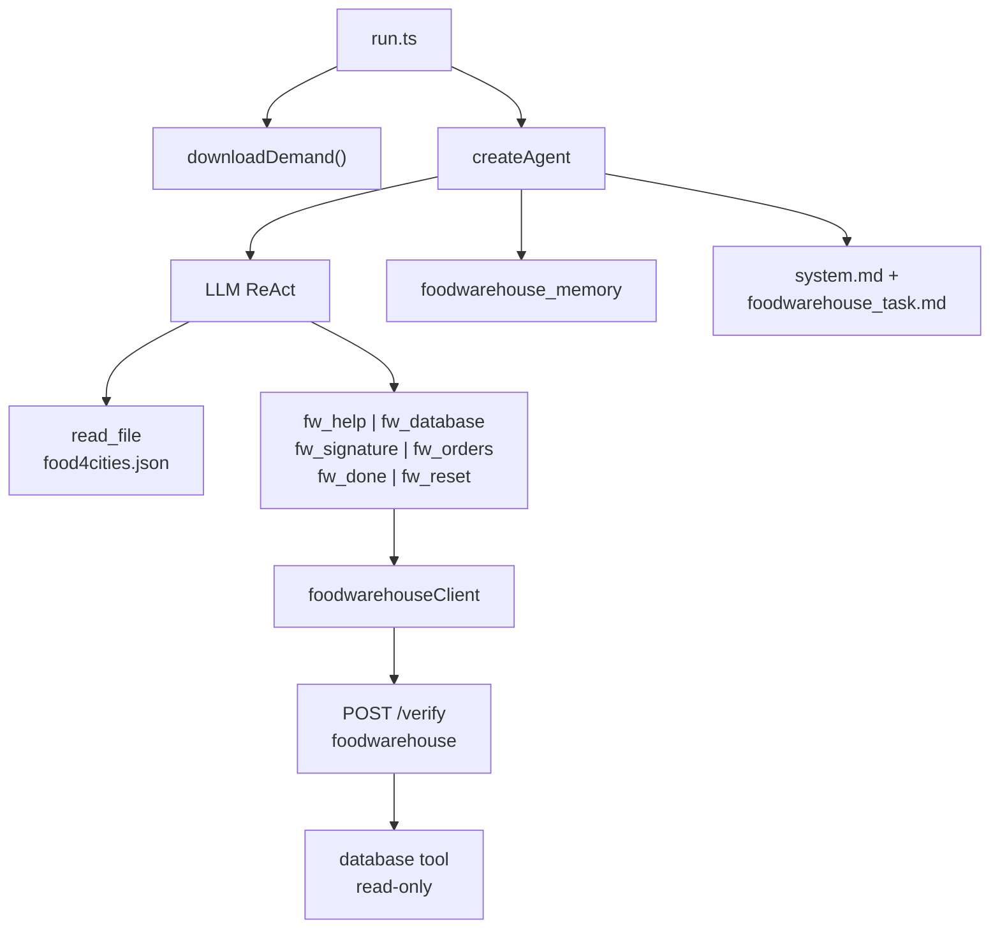

# Plan wdrożenia — S04E05 homework `foodwarehouse` (agent + narzędzia)

**Normatywny research:** [foodwarehouse.research.md](foodwarehouse.research.md) — profil **agent-first** (wzorzec `filesystem` / `domatowo` / `firmware`)  
**Workspace:** `tasks/s04e05/` (greenfield)  
**Status:** Plan — **czeka na akceptację**

**Wildly Important Goal**

**Goal:** Zbudować aplikację agentową `tasks/s04e05/`, która dostarcza **narzędzia i prompty** — a **agent LLM w runtime** (`bun run run.ts`) sam eksploruje API magazynu i bazę SQLite, tworzy zamówienia dla 8 miast i uzyskuje flagę.

**Success measure:** `bun test` + `tsc` PASS (tylko infrastruktura); manualnie agent zwraca `{FLG:...}`; **brak** solvera magazynowego w repo.

**Do NOT touch / do NOT add:**

- `buildOrders.ts`, `aggregateDemand.ts`, `mapDestinations.ts` (logika domenowa)
- `orchestrator.ts` bez `createAgent` (profil `windpower`)
- Gotowe mapy miast → `destination_id` w kodzie lub promptach
- Rozwiązanie zadania przez Cursor (hardcoded zamówienia)
- Zmiany `tasks/boilerplate/src/`

**Opis podejścia:** `run.ts` → `downloadDemand()` → `createAgent` + MCP (`fw_*`) + `read_file` + prompty. Mapowanie miast, podpisy i zawartość zamówień = **praca agenta**.

**Decyzje:**

| # | Pytanie | Decyzja |
| --- | --- | --- |
| 1 | Kto rozwiązuje zadanie? | **Agent AI w runtime** (wymaganie użytkownika) |
| 2 | Co dostarcza implementacja? | **Narzędzia MCP + prompty + ingest JSON** |
| 3 | Entrypoint | **`run.ts`** z `createAgent` (jedyny produkcyjny) |
| 4 | Wzorzec epizodu | **`s04e04/filesystem`**, `s04e03/domatowo`, `s03e02/firmware` |
| 5 | Antywzorzec | Deterministyczny orchestrator (`s04e02/windpower`) |
| 6 | Liczba zamówień | **Jedno na miasto** z `food4cities.json` (8) — patrz research §2.2 |
| 7 | Append towarów | Agent używa **batch** `items: { towar: qty }` (prompt) |
| 8 | `read_file` vs HTTP | **`downloadDemand` + `read_file`** z boilerplate MCP |
| 9 | Narzędzia MCP | **6 wąskich** `fw_*` (nie jedno generyczne) |
| 10 | Model domyślny | **`gpt-4o`** (`AGENT_MODEL` override) |
| 11 | `AGENT_MAX_OUTPUT_TOKENS` | **4096** |
| 12 | `AGENT_MAX_ITERATIONS` | **20** (env, jak boilerplate / `s04e04`) |
| 13 | Planning phase | **`enablePlanningPhase: true`** |
| 14 | Memory hooks | **`foodwarehouse_memory`** po `fw_done` / błędach orders |
| 15 | Langfuse | Opt-in jak `s04e04` (tracing w `run.ts`) |

---

## Technical Context

| Obszar | Wartość |
| --- | --- |
| **Stack** | Bun, TypeScript, `zod`, `@ai-devs/agent-boilerplate`, MCP SDK |
| **Agent** | `createAgent`, `enablePlanningPhase: true`, `AGENT_MAX_ITERATIONS` (dom. 20) |
| **Model** | Default **`gpt-4o`**; eskalacja **`anthropic/claude-sonnet-4-6`** |
| **`AGENT_MAX_OUTPUT_TOKENS`** | **4096** |
| **Env** | `OPENAI_API_KEY`, `HUB_API_KEY`, opcjonalnie `AGENT_MODEL`, Langfuse |
| **Hub** | `POST https://hub.ag3nts.org/verify`, `task: foodwarehouse` |
| **Dane** | `https://hub.ag3nts.org/dane/food4cities.json` → `data/food4cities.json` |
| **Wzorce kodu** | `tasks/s04e04/run.ts`, `src/hub/filesystemClient.ts`, `src/tools/mcp/fs_*.ts` |
| **Testy** | `bun test`, `bunx tsc --noEmit` — MCP/client/ingest only |
| **Uruchomienie** | `bun --env-file=../.env run run.ts` |
| **Probe dev** | `bun --env-file=../.env run scripts/probe-help.ts` |

---

## 1. Granica implementacji (normatywna)

### 1.1 Dozwolone (infrastruktura)

| Plik / moduł | Odpowiedzialność |
| --- | --- |
| `foodwarehouseClient.ts` | `postFoodwarehouseAnswer(answer)` — HTTP + `fetchWithRetry` + `mcpOk`/`mcpErr` |
| `fw_*.ts` | Cienkie MCP — Zod na **kształt** argumentów |
| `downloadDemand.ts` | `fetch` JSON → `data/food4cities.json`, cache jeśli plik istnieje |
| `foodwarehouse_task.md` | Spec zadania, flow, wskazówki eksploracji DB |
| `foodwarehouse_memory.ts` | `recordFoodwarehouseResult`, inject po błędzie `fw_done` |
| `run.ts` | Bootstrap agenta, **bez** logiki magazynowej |
| Testy | Mock hub — czy MCP buduje poprawny `answer` |

### 1.2 Zabronione (solver)

| Element | Powód |
| --- | --- |
| Funkcje agregujące zapotrzebowanie z JSON | Zastępuje agenta |
| Automatyczne pętle `for (city of cities) createOrder()` w `run.ts` | Orchestrator bez AI |
| MCP `fw_create_all_orders` | Black box |
| Stałe `DESTINATION_MAP` w `config.ts` | Hardcoded rozwiązanie |
| Prompty z listą 8 destination_id | Wyciek rozwiązania |
| `index.ts` wywołujący solver zamiast agenta | Obejście wymagania |

---

## 2. Architektura runtime

### 2.1 Diagram przepływu



### 2.2 Sekwencja typowej sesji agenta (referencyjna — nie kod)

```text
Tura 0 (planning):
  fw_help
  read_file(data/food4cities.json)
  fw_database("show tables")
  fw_database("show create table destinations")
  → plan: 8 miast, kolejność, strategia creatorów

Tury 1..N (per miasto lub grupami):
  fw_database("select destination_id, name from destinations where name = 'Opalino'")
  fw_database("select user_id, login, birthday from users where role=2 and is_active=1 limit 5")
  fw_signature({ login, birthday, destination })
  fw_orders({ action: "create", title, creatorID, destination, signature })
  fw_orders({ action: "append", id, items: { ... z JSON ... } })

Tura końcowa:
  fw_orders({ action: "get" })   # opcjonalnie
  fw_done                        # → {FLG:...} lub missing[]
  finish_task                    # po fladze
```

Przy błędzie: `fw_reset` → powtórz tworzenie (decyzja agenta).

### 2.3 Narzędzia agenta (docelowe)

| Narzędzie | Input (Zod) | Handler → hub `answer` |
| --- | --- | --- |
| `read_file` | path, offset?, limit? | boilerplate — tylko `data/food4cities.json` (+ ewent. README) |
| `fw_help` | `{}` | `{ tool: "help" }` |
| `fw_database` | `{ query: string }` | `{ tool: "database", query }` |
| `fw_orders` | discriminated `action` | `{ tool: "orders", ... }` |
| `fw_signature` | `{ login, birthday, destination }` | `{ tool: "signatureGenerator", action: "generate", ... }` |
| `fw_done` | `{}` | `{ tool: "done" }` + extractFlag |
| `fw_reset` | `{}` | `{ tool: "reset" }` |
| `finish_task` | native | po `{FLG:...}` |

### 2.4 `fw_orders` — schemat Zod (shape only)

```typescript
// src/tools/mcp/schemas.ts
import { z } from "zod";

export const fwOrdersSchema = z.discriminatedUnion("action", [
  z.object({
    action: z.literal("get"),
    id: z.string().optional().describe("Optional order id"),
  }),
  z.object({
    action: z.literal("create"),
    title: z.string().describe("Order title"),
    creatorID: z.number().int().describe("Existing user_id from database"),
    destination: z.number().int().describe("destination_id from destinations table"),
    signature: z.string().describe("SHA1 hash from fw_signature"),
  }),
  z.object({
    action: z.literal("append"),
    id: z.string().describe("Order id from create/get"),
    name: z.string().optional().describe("Single item name (single mode)"),
    items: z
      .union([
        z.number().int(),
        z.record(z.string(), z.number().int()),
        z.array(
          z.object({
            name: z.string(),
            items: z.number().int(),
          }),
        ),
      ])
      .optional()
      .describe("Quantity, batch map, or array of {name, items}"),
  }),
  z.object({
    action: z.literal("delete"),
    id: z.string().describe("Order id to delete"),
  }),
]);

export const fwDatabaseSchema = z.object({
  query: z
    .string()
    .min(1)
    .describe(
      "SQL SELECT or meta: show tables, show create table X, .schema",
    ),
});

export const fwSignatureSchema = z.object({
  login: z.string().describe("User login from users table"),
  birthday: z
    .string()
    .regex(/^\d{4}-\d{2}-\d{2}$/)
    .describe("YYYY-MM-DD matching users.birthday"),
  destination: z.number().int().describe("destination_id for the target city"),
});
```

### 2.5 `foodwarehouseClient.ts` — kontrakt

```typescript
// Wzorzec: tasks/s04e04/src/hub/filesystemClient.ts
import {
  fetchWithRetry,
  mcpErr,
  mcpOk,
  type McpToolResponse,
} from "@ai-devs/agent-boilerplate";
import { extractFlag } from "../../../boilerplate/src/tools/mcp/submit_to_hub.js";

const TASK_NAME = "foodwarehouse";

export type FoodwarehouseAnswer = Record<string, unknown>;

export async function postFoodwarehouseAnswer(
  answer: FoodwarehouseAnswer,
): Promise<McpToolResponse> {
  // 1. resolve HUB_API_KEY
  // 2. POST { apikey, task: TASK_NAME, answer }
  // 3. parse JSON, extractFlag(rawText)
  // 4. return mcpOk(JSON.stringify({ ok, status, data, flag? }))
}
```

**Eksporty pomocnicze (opcjonalne):** `fetchFoodwarehouseHelp()`, `postFoodwarehouseDone()` — cienkie wrapery dla probe script.

### 2.6 Bootstrap `run.ts` (szkic)

```typescript
// 1. resetFoodwarehouseState()
// 2. const demandPath = await downloadDemand()
// 3. const instructions = buildInstructions(demandPath)
// 4. createS04e05McpServer() — read_file + fw_* w jednym serwerze (§2.7)
// 5. createAgent({
//      ai: withTracingAdapter(...),
//      instructions,
//      tools: [...mcpToolDefs, finishTaskToolDefinition],
//      handlers: { ... map MCP, recordFoodwarehouseResult on fw_* },
//      memory: createFoodwarehouseMemoryHooks(),
//      enablePlanningPhase: resolveEnablePlanningPhase(true),
//      maxIterations: AGENT_MAX_ITERATIONS,
//      maxToolOutputChars: FOODWAREHOUSE_MAX_TOOL_OUTPUT_CHARS,
//    })
// 6. agent.processQuery(buildUserQuery(enablePlanningPhase))
```

**`buildUserQuery` (szkic):**

```typescript
function buildUserQuery(planning: boolean): string {
  if (planning) {
    return (
      "Rozpocznij foodwarehouse. Tura 0: plan (fw_help → read_file food4cities.json → " +
      "fw_database schema → dla każdego miasta: signature → create → append batch → fw_done). " +
      "Iteruj na missing z fw_done aż {FLG:...}."
    );
  }
  return "Wykonaj foodwarehouse: eksploruj API/DB, utwórz zamówienia dla wszystkich miast z JSON, fw_done aż {FLG:...}.";
}
```

### 2.7 Integracja `read_file`

#### Kontekst: jeden klient MCP = jeden serwer

`createMcpClient(server)` w boilerplate łączy się przez **`InMemoryTransport`** z **jednym** `McpServer` ([`tasks/boilerplate/src/mcp/client.ts`](../../../boilerplate/src/mcp/client.ts)). W `run.ts` masz więc zawsze **jedną** listę narzędzi przekazywaną do `createAgent`.

Nie ma w repo wzorca „dwa równoległe serwery MCP” pod jednego agenta — gdybyś chciał dwa `McpServer`, musiałbyś ręcznie scalić `listMcpTools` i `handlers` z dwóch klientów (zbędna złożoność; **nie** stosujemy).

Pytanie brzmi więc nie „jeden czy dwa serwery”, lecz **skąd wziąć implementację `read_file`** i **które narzędzia pokazać modelowi**.

#### Co rejestruje boilerplate domyślnie

`createBoilerplateMcpServer()` ([`tasks/boilerplate/src/mcp/server.ts`](../../../boilerplate/src/mcp/server.ts)) dodaje **4** narzędzia:

| Narzędzie | Sens w `foodwarehouse` |
| --- | --- |
| `read_file` | **Potrzebne** — odczyt `data/food4cities.json` |
| `http_request` | **Zbędne / szkodliwe** — agent mógłby omijać `fw_*` i składać surowe POST na `/verify` |
| `submit_to_hub` | **Zbędne** — inny kształt `answer` niż `{ tool: "orders", ... }`; epizod ma dedykowane `fw_*` |
| `analyze_image_vision` | **Zbędne** — brak obrazów w zadaniu |

Dokumentacja boilerplate sugeruje rozszerzanie serwera przez `server.registerTool(...)` **na instancji zwróconej przez** `createBoilerplateMcpServer()` — to działa technicznie, ale dla tego homeworku **nadmiar narzędzi** psuje profil agenta (wzorzec jak [domatowo](../../s04e03/docs/specs/s04e03-domatowo/s04e03-domatowo.plan.md): minimalna powierzchnia MCP).

#### Opcja A (zalecana): jeden serwer epizodu + handler `read_file` z boilerplate

**Wzorzec kanoniczny:** [`tasks/s04e04/src/mcp/server.ts`](../../s04e04/src/mcp/server.ts) — **nie** wywołuje `createBoilerplateMcpServer()`, tylko tworzy **własny** `McpServer` i **importuje wyłącznie** to, czego potrzebuje z pakietu:

```typescript
// src/mcp/server.ts — wzorzec s04e04, adaptacja s04e05
import { McpServer } from "@modelcontextprotocol/sdk/server/mcp.js";
import {
  executeReadFile,
  readFileInputSchema,
} from "../../../boilerplate/src/tools/mcp/read_file.js";
import { executeFwHelp } from "../tools/mcp/fw_help.js";
// ... pozostałe fw_*

export function createS04e05McpServer(): McpServer {
  const server = new McpServer(
    { name: "s04e05-foodwarehouse", version: "1.0.0" },
    { capabilities: { tools: {} } },
  );

  server.registerTool(
    "read_file",
    {
      description:
        "Read local text file — use for food4cities.json demand data. " +
        "Path is given in task spec (under data/). Use offset/limit if large.",
      inputSchema: readFileInputSchema,
    },
    executeReadFile,
  );

  // fw_help, fw_database, fw_orders, fw_signature, fw_done, fw_reset
  registerFoodwarehouseTools(server);

  return server;
}
```

**`run.ts` (uproszczony przepływ):**

```typescript
const mcpServer = createS04e05McpServer();          // jeden serwer
const mcpClient = await createMcpClient(mcpServer);   // jeden klient
const mcpToolDefs = mcpToolsToOpenAI(await listMcpTools(mcpClient));
const allTools = [...mcpToolDefs, finishTaskToolDefinition];
// handlers: map każdego fw_* + read_file → callMcpTool(mcpClient, name, args)
```

**Dlaczego to nazywamy „scalonym” serwerem:** w jednym `McpServer` żyją narzędzia z **dwóch warstw kodu**:

```text
┌─────────────────────────────────────────────────────────┐
│  createS04e05McpServer()  — jeden McpServer, jeden Client │
├─────────────────────────────────────────────────────────┤
│  Z boilerplate (import handler + Zod, bez całego server) │
│    • read_file  → executeReadFile, readFileInputSchema   │
├─────────────────────────────────────────────────────────┤
│  Z epizodu (src/tools/mcp/fw_*.ts)                       │
│    • fw_help, fw_database, fw_orders, …                  │
└─────────────────────────────────────────────────────────┘
         │
         ▼
   createAgent({ tools, handlers })  +  finish_task (native)
```

| Zaleta | Wyjaśnienie |
| --- | --- |
| **Minimalna powierzchnia dla LLM** | Agent widzi tylko `read_file` + `fw_*` + `finish_task` — nie ma pokusy `http_request` / `submit_to_hub` |
| **Reuse bez kopiowania logiki** | Chunking, sandbox ścieżek, `mcpOk`/`mcpErr` zostają w boilerplate |
| **Spójność z S04E04** | Ten sam idiom co filesystem; łatwy code review |
| **Jeden `callMcpTool`** | Wszystkie handlery wołają ten sam `mcpClient` |

**Opis w prompcie:** w `foodwarehouse_task.md` podaj **konkretną ścieżkę** do JSON (np. `data/food4cities.json` względem cwd epizodu) — agent nie „zgaduje” path; Ty go wstrzykujesz w `buildInstructions()` jak ścieżki notatek w s04e04.

#### Opcja B: rozszerzenie `createBoilerplateMcpServer()`

```typescript
const server = createBoilerplateMcpServer();
registerFoodwarehouseTools(server); // doklejasz fw_* do pełnego boilerplate
const mcpClient = await createMcpClient(server);
```

| | |
| --- | --- |
| **Plus** | Najmniej linii w `server.ts` |
| **Minus** | Model dostaje **7+ narzędzi** zamiast 7; ryzyko wywołania `submit_to_hub` z `answer: { action: ... }` (filesystem shape) zamiast `fw_orders` |
| **Werdykt** | **Nie** dla `foodwarehouse` — profil jak domatowo/okoeditor (wąskie MCP) |

#### Opcja C (odrzucona): dwa serwery, dwa klienty, merge w `run.ts`

```typescript
// ANTYWZORZEC — nie implementować
const boilerClient = await createMcpClient(createBoilerplateMcpServer());
const episodeClient = await createMcpClient(createS04e05McpServer()); // tylko fw_*
// ręczne łączenie listTools + dwa zestawy handlers
```

Podwaja wiring, nic nie daje ponad Opcją A.

#### Sandbox ścieżek `read_file`

`executeReadFile` w boilerplate ([`read_file.ts`](../../../boilerplate/src/tools/mcp/read_file.ts)) rozwiązuje ścieżki względem `process.cwd()` i odrzuca ścieżki poza workspace — **nie** ma osobnego chroot na `data/`.

Dla epizodu wystarczy:

1. Uruchamiać z katalogu `tasks/s04e05/` (`bun run run.ts`).
2. W prompcie podać ścieżkę pod `data/` (po `downloadDemand()`).
3. **Nie** podawać w promptach ścieżek do `../.env` ani katalogu repo root.

Opcjonalny wrapper `executeReadFileChrooted` w epizodzie — tylko gdy review wykaże potrzebę; na start **nie** wymagany (jak s04e04).

#### Decyzja implementacyjna (F3.5)

| ID | Decyzja |
| --- | --- |
| F3.5 | **`createS04e05McpServer()`** — Opcja A: jeden serwer, `read_file` przez import z boilerplate, **bez** `createBoilerplateMcpServer()` |

---

## 3. Zakres plików

```text
tasks/s04e05/
├── run.ts
├── index.ts                        # opcjonalny: import run lub echo stub
├── config.ts
├── package.json
├── tsconfig.json
├── .gitignore
├── README.md
├── scripts/
│   └── probe-help.ts
├── docs/specs/foodwarehouse/
│   ├── foodwarehouse.research.md
│   └── foodwarehouse.plan.md
└── src/
    ├── hub/
    │   ├── foodwarehouseClient.ts
    │   ├── foodwarehouseClient.test.ts
    │   └── types.ts
    ├── ingest/
    │   ├── downloadDemand.ts
    │   └── downloadDemand.test.ts
    ├── mcp/
    │   └── server.ts
    ├── tools/mcp/
    │   ├── schemas.ts
    │   ├── fw_help.ts
    │   ├── fw_database.ts
    │   ├── fw_orders.ts
    │   ├── fw_signature.ts
    │   ├── fw_done.ts
    │   ├── fw_reset.ts
    │   └── fw_orders.test.ts
    ├── prompts/
    │   ├── system.md
    │   └── foodwarehouse_task.md
    └── agent/
        ├── foodwarehouse_memory.ts
        └── foodwarehouse_memory.test.ts
```

**Nie tworzyć:** `src/domain/`, `orchestrator.ts`, `solver.ts`.

---

## 3.1 `config.ts` (normatywne)

```typescript
export const HUB_VERIFY_URL =
  process.env["HUB_VERIFY_URL"]?.trim() ?? "https://hub.ag3nts.org/verify";

export const FOOD4CITIES_URL =
  "https://hub.ag3nts.org/dane/food4cities.json";

export const DEMAND_LOCAL_PATH = "data/food4cities.json";

export const DEFAULT_AGENT_MODEL =
  process.env["AGENT_MODEL"]?.trim() ?? "gpt-4o";

/** ReAct iteration cap — override via AGENT_MAX_ITERATIONS in tasks/.env */
export const AGENT_MAX_ITERATIONS = posInt("AGENT_MAX_ITERATIONS", 20);

export const FOODWAREHOUSE_MAX_TOOL_OUTPUT_CHARS = 12_000;

export const AGENT_MAX_OUTPUT_TOKENS = 4096;

export const TRACING_SERVICE_NAME = "s04e05-foodwarehouse";
```

---

## 3.2 `package.json` (szkic)

```json
{
  "name": "@ai-devs/s04e05-foodwarehouse",
  "private": true,
  "type": "module",
  "dependencies": {
    "@ai-devs/agent-boilerplate": "file:../boilerplate",
    "@modelcontextprotocol/sdk": "^1.x",
    "zod": "^3.x"
  },
  "scripts": {
    "start": "bun --env-file=../.env run run.ts",
    "probe": "bun --env-file=../.env run scripts/probe-help.ts",
    "test": "bun test",
    "typecheck": "bunx tsc --noEmit"
  }
}
```

---

## 4. Prompty — treść do implementacji

### 4.1 `src/prompts/system.md`

Krótki (~30–50 linii):

- Rola: agent magazynu żywności AI Devs / operacja foodwarehouse.
- Zasady ReAct: myśl → narzędzie → obserwuj wynik.
- Nigdy nie zgaduj ID — używaj `fw_database`.
- Mutacje zamówień dopiero po planie i podpisie.
- `finish_task` wyłącznie po `{FLG:...}` w wyniku `fw_done`.

### 4.2 `src/prompts/foodwarehouse_task.md`

Placeholdery w `buildInstructions()`:

| Placeholder | Wartość |
| --- | --- |
| `{{DEMAND_JSON_PATH}}` | Absolutna lub względna ścieżka do `food4cities.json` |
| `{{FOOD4CITIES_URL}}` | URL źródłowy (informacyjnie) |

Sekcje:

1. **Cel** — 8 miast, osobne zamówienia, `fw_done`.
2. **Źródła danych** — plik JSON + SQLite przez `fw_database`.
3. **Flow** — numbered list (research §5.2).
4. **Podpisy** — `fw_signature` przed `create`; `creatorID` = `user_id`.
5. **Append** — preferuj batch `items` object.
6. **Walidacja** — `fw_done` zwraca `missing` — czytaj dosłownie.
7. **Reset** — gdy stan zamówień jest zły.
8. **Anti-patterns** — lista z research §4.3.

**Kontrola jakości promptu:** brak konkretnych `destination_id`, hashy, order id.

---

## 5. `foodwarehouse_memory.ts`

Wzorzec 1:1 z `filesystem_memory.ts`:

| Funkcja | Opis |
| --- | --- |
| `resetFoodwarehouseState()` | Na start `run.ts` |
| `recordFoodwarehouseResult(text)` | Parsuj JSON z MCP; ustaw `lastFlag`, `lastHubMessage` |
| `createFoodwarehouseMemoryHooks()` | `beforeTurn`: strip + inject working plan gdy `needsRevision()` |

**Hub tools do record:** `fw_done`, `fw_orders`, opcjonalnie `fw_signature` (błędy generate).

**Revised plan (inject):**

```text
1. fw_help — odśwież reguły API.
2. read_file — zweryfikuj ilości z food4cities.json.
3. fw_database — popraw mapowanie destination / użytkownika.
4. fw_orders get — zobacz aktualny stan.
5. fw_reset jeśli zamówienia są nie do naprawy.
6. Dla brakujących miast z missing: signature → create → append.
7. fw_done — napraw konkretny błąd z message/missing.
8. finish_task tylko po {FLG:...}.
```

Test: `foodwarehouse_memory.test.ts` — symulacja odpowiedzi `done` z `missing`.

---

## 6. Fazy implementacji

### Faza 1 — Scaffold epizodu

**Verification:** `bun install && bunx tsc --noEmit`

| ID | Zadanie | DoD |
| --- | --- | --- |
| F1.1 | `package.json`, `tsconfig.json`, `config.ts` | `bun install` OK |
| F1.2 | `.gitignore` (`data/`) | — |
| F1.3 | `README.md` — quick start, env, antywzorzec orchestrator | — |
| F1.4 | Stub `run.ts` z komentarzem TODO `createAgent` | kompiluje się |
| F1.5 | `index.ts` opcjonalny | — |

---

### Faza 2 — Hub client + ingest

**Verification:** `bun test src/hub src/ingest`

| ID | Zadanie | DoD |
| --- | --- | --- |
| F2.1 | `foodwarehouseClient.ts` + `types.ts` | `postFoodwarehouseAnswer`, `extractFlag` |
| F2.2 | `downloadDemand.ts` | cache pliku, tworzy `data/` |
| F2.3 | `scripts/probe-help.ts` | wydruk help przy `bun run probe` |
| F2.4 | Testy client (mock `fetch`) + ingest | `bun test` PASS |

---

### Faza 3 — MCP narzędzia (`fw_*`)

**Verification:** `bun test src/tools/mcp`

| ID | Zadanie | DoD |
| --- | --- | --- |
| F3.1 | `schemas.ts` — Zod dla orders/database/signature | opisy `.describe()` |
| F3.2 | `fw_help`, `fw_done`, `fw_reset` | cienkie proxy |
| F3.3 | `fw_database`, `fw_signature`, `fw_orders` | proxy + Zod parse input |
| F3.4 | `mcp/server.ts` — `createS04e05McpServer()` | rejestruje 6 narzędzi |
| F3.5 | `createS04e05McpServer()` — `read_file` (import z boilerplate) + `fw_*` w jednym serwerze (§2.7 Opcja A) | agent czyta JSON |
| F3.6 | Testy MCP (mock client) | PASS |

---

### Faza 4 — Agent runtime (`run.ts`)

**Verification:** `bunx tsc --noEmit`; manual smoke (agent startuje)

| ID | Zadanie | DoD |
| --- | --- | --- |
| F4.1 | `prompts/system.md`, `prompts/foodwarehouse_task.md` | bez hardcoded rozwiązania |
| F4.2 | `buildInstructions()`, `buildUserQuery()` | placeholdery |
| F4.3 | `foodwarehouse_memory.ts` + test | inject po błędzie |
| F4.4 | `run.ts` — pełny `createAgent` | **brak** pętli solvera |
| F4.5 | Langfuse opt-in (jak s04e04) | opcjonalne |
| F4.6 | Handlers — `recordFoodwarehouseResult` na `fw_done`, `fw_orders` | — |

---

### Faza 5 — Jakość i dokumentacja

**Verification:** `bun test && bunx tsc --noEmit`

| ID | Zadanie | DoD |
| --- | --- | --- |
| F5.1 | README: architektura, diagram, komendy | link do research |
| F5.2 | Przegląd antywzorców (grep: orchestrator, buildOrders) | brak hitów |
| F5.3 | `AGENT_MODEL` w README | gpt-4o default |

---

### Faza 6 — Manual E2E (agent rozwiązuje)

**Verification:** flaga w logu

| ID | Zadanie | DoD |
| --- | --- | --- |
| F6.1 | `bun --env-file=../.env run run.ts` | `{FLG:...}` |
| F6.2 | Przy fail: iteracja promptów / model | notatka w README Troubleshooting |
| F6.3 | Opcjonalnie 2–3 runy — stabilność trajektorii | akceptacja niedeterminizmu |

**Uwaga:** E2E zależy od modelu i API — nie jest gate CI (jak filesystem).

---

## 7. Acceptance criteria (epizod)

| # | Kryterium | Weryfikacja |
| --- | --- | --- |
| AC1 | `run.ts` używa `createAgent` | code review |
| AC2 | Brak solvera domenowego w `src/` | grep / review |
| AC3 | 6 narzędzi `fw_*` + `read_file` + `finish_task` | MCP list tools |
| AC4 | `bun test` PASS | CI lokalne |
| AC5 | `bunx tsc --noEmit` PASS | CI lokalne |
| AC6 | Agent manualnie zwraca flagę | E2E F6.1 |
| AC7 | Prompty bez hardcoded destination_id | review |
| AC8 | Memory inject po błędzie `fw_done` | test + log |

---

## 8. Ryzyka implementacyjne

| Ryzyko | Mitigacja w planie |
| --- | --- |
| Zbyt mało tur na 8 miast | `AGENT_MAX_ITERATIONS=20` w env / `config.ts` |
| Odpowiedź `database` obcięta | prompt: WHERE po nazwie miasta |
| Nadmiar narzędzi (`http_request` obok `fw_*`) | F3.5 — **nie** używać `createBoilerplateMcpServer()`; tylko Opcja A §2.7 |
| Import `extractFlag` ze ścieżki boilerplate | ten sam wzorzec co s04e04 |
| Agent tworzy zamówienia bez eksploracji | planning phase + userQuery |

---

## 9. Execution plan (po akceptacji planu)

Kolejność delegacji (Full Flow):

```text
1. Software Engineer — Fazy 1–3 (scaffold, client, MCP)
2. Validation — bun test, tsc
3. Software Engineer — Faza 4 (run.ts, prompty, memory)
4. Validation — bun test, tsc
5. Software Engineer — Faza 5 (README)
6. Manual E2E — Faza 6 (użytkownik / implementer)
7. Code Reviewer — eversis-review
8. Fine + QA comment draft
```

---

## 10. Changelog planu

| Data | Zmiana |
| --- | --- |
| 2026-06-29 | Plan początkowy — agent-first foodwarehouse, 6 faz, wzorzec s04e04 |
