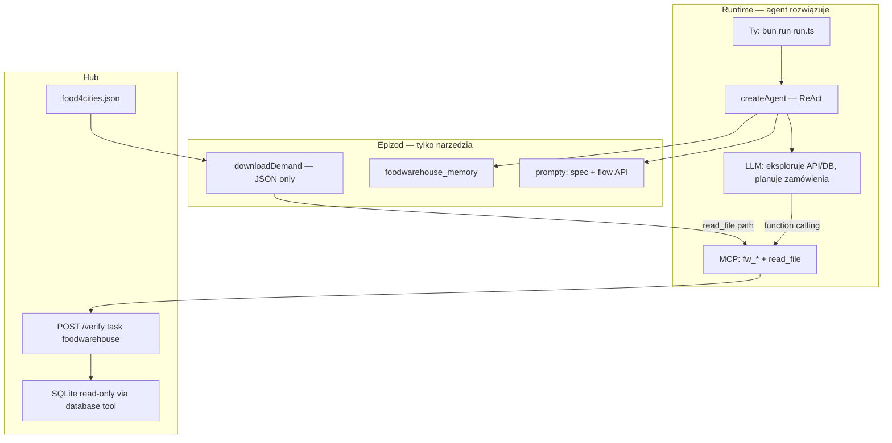

# S04E05 — homework `foodwarehouse` — research

**Task:** Przeanalizować zadanie domowe **`foodwarehouse`** z lekcji S04E05 oraz zaprojektować **osobną aplikację agentową** w `tasks/s04e05/` na bazie `@ai-devs/agent-boilerplate`. Research/plan dostarcza **wyłącznie infrastrukturę i narzędzia** (MCP, prompty, ingest JSON). **Rozwiązanie zadania** (odkrycie schematu bazy, mapowanie miast, wybór użytkowników, podpisy, tworzenie zamówień, flaga) należy do **agenta AI w runtime** — nie do Cursora, nie do deterministycznego orchestratora w kodzie epizodu.

**Data:** 2026-06-29  
**Status:** Research — **czeka na akceptację**  
**Plan (po akceptacji):** [foodwarehouse.plan.md](foodwarehouse.plan.md)

**Powiązane:**

- [s04e05-internal-solutions-design.research.md](../../../boilerplate/docs/specs/s04e05-internal-solutions-design/s04e05-internal-solutions-design.research.md) — lekcja S04E05 vs rozszerzenia pakietu (homework poza scope pakietu)
- [boilerplate-documentation.md](../../../docs/boilerplate-documentation.md) — §2.9 (wiersz `foodwarehouse`)
- [filesystem.research.md](../../s04e04/docs/specs/filesystem/filesystem.research.md) — **wzorzec kanoniczny**: cienkie MCP + ReAct, inteligencja w modelu
- [s04e03-domatowo.research.md](../../s04e03/docs/specs/s04e03-domatowo/s04e03-domatowo.research.md) — ten sam profil hub (proxy MCP, zero solvera)
- [s04e02-windpower.research.md](../../s04e02/docs/specs/s04e02-windpower/s04e02-windpower.research.md) — **antywzorzec** (deterministyczny orchestrator bez agenta)
- [s03e02 firmware](../../s03e02/) — wzorzec epizodu hub na boilerplate

**Źródła:**

- `markdowns/s04e05-projektowanie-rozwiazan-wewnatrzfirmowych-1775189135.md` — fabuła + spec zadania (`published_at: 2026-04-03`)
- `tasks/boilerplate/` — ReAct, MCP, `http_request`, `submit_to_hub`, `fetchWithRetry`, planning, memory hooks
- **Probe API** (2026-06-29): `POST https://hub.ag3nts.org/verify`, `task: foodwarehouse`
- **Probe danych** (2026-06-29): [food4cities.json](https://hub.ag3nts.org/dane/food4cities.json) — 8 miast, mapy `{ towar: ilość }`

**Weryfikacja UI:** brak (czyste API hub).

**Scope wyłączony z implementacji w tym wątku:** rozwiązanie zadania przez Cursor (chat lub hardcoded solver); zmiany w `tasks/boilerplate/src/`; orchestrator TypeScript bez `createAgent` (profil `windpower`).

---

## 0. Kontekst lekcji vs zadanie domowe

### 0.1 Lekcja S04E05 (rozwiązania wewnątrzfirmowe)

Lekcja uczy projektowania **wewnętrznych narzędzi AI** w organizacji: od lekkich dokumentów (checklisty, onboarding, style) przez dedykowane aplikacje procesowe z **UI i człowiekiem w pętli** po **MCP Apps** łączące wiele usług. Referencje runtime: `lessons/04_05_review/`, `lessons/04_05_apps/` — **nie** `@ai-devs/agent-boilerplate`.

Motyw fabularny: wirtualny włam do systemów magazynowych Zygfryda, aby skierować autonomiczne transportery z żywnością do potrzebujących miast.

### 0.2 Zadanie domowe `foodwarehouse` (inny profil)

Homework to **jednorazowa operacja magazynowa** przez API hub + **read-only SQLite**:

1. Poznać API (`help`) i schemat bazy (`database`).
2. Ustalić zapotrzebowanie miast z `food4cities.json`.
3. Dla każdego miasta: znaleźć `destination_id`, wybrać `creatorID`, wygenerować `signature`, utworzyć zamówienie i uzupełnić towary.
4. `done` → flaga `{FLG:...}`.

To epizod **hub + zdalna baza**, opisany w §2.9 dokumentacji boilerplate:

```text
Homework hub (foodwarehouse) → http_request + SQLite w epizodzie; explore → plan → execute
Antywzorzec: ReAct zgadujący API magazynu (bez narzędzi) LUB deterministyczny orchestrator zastępujący agenta
```

### 0.3 Granica: infrastruktura vs inteligencja (normatywne)

Wzorzec jak [filesystem §0.3](../../s04e04/docs/specs/filesystem/filesystem.research.md#03-granica-infrastruktura-vs-inteligencja-normatywne) i [domatowo §2](../../s04e03/docs/specs/s04e03-domatowo/s04e03-domatowo.research.md):

| Warstwa | Co wchodzi | Kto „myśli” |
| --- | --- | --- |
| **Cursor / research / plan** | Spec narzędzi, prompty, kontrakt MCP, ingest JSON | **Nie** — zero mapowania miast, zero listy zamówień |
| **Implementer epizodu** | `createAgent`, MCP proxy hub, prompty `.md`, `run.ts`, testy MCP | **Nie** — zero `buildOrders.ts`, zero agregacji zapotrzebowania w TS |
| **Agent AI (runtime)** | Eksploruje API/DB, planuje zamówienia, woła narzędzia, iteruje na `done` | **Tak** — tu jest rozwiązanie zadania |
| **Boilerplate** | ReAct, adapter, retry, logger, `finish_task` | Runtime |

**Deliverable research/plan:** aplikacja z **odpowiednimi narzędziami**, tak aby agent po `bun run run.ts` **sam** dotarł do flagi.

### 0.4 Wymaganie użytkownika (agent AI, nie orchestrator)

Użytkownik **wyraźnie** odrzuca rozwiązania typu deterministyczny orchestrator bez udziału AI (profil `s04e02/windpower`). Docelowa architektura to **agent ReAct** z cienkimi narzędziami MCP — model podejmuje decyzje eksploracyjne i operacyjne; kod epizodu **nie** implementuje algorytmu „pobierz JSON → zbuduj 8 zamówień → wyślij”.

Deterministyczna logika **dozwolona** wyłącznie w warstwie infrastruktury: HTTP POST, retry 503, walidacja Zod **kształtu** argumentów narzędzi (nie treści merytorycznej).

---

## 1. Executive summary

| Pytanie | Odpowiedź |
| --- | --- |
| **Czy da się zbudować aplikację na boilerplate?** | **Tak** — `createAgent` + cienkie MCP + `read_file` + prompty |
| **Kto rozwiązuje zadanie?** | **Agent LLM w runtime** — eksploruje API/DB, tworzy zamówienia, iteruje na `done` |
| **Co dostarcza research/plan?** | **Narzędzia i infrastrukturę** — nie solver magazynowy w TS |
| **Rekomendowany profil** | **Agent-first** (jak `filesystem` / `domatowo` / `firmware`) |
| **Antywzorzec** | `orchestrator.ts` z `Promise.all` bez `createAgent` (`windpower`) |
| **Główna trudność agenta** | Mapowanie nazw miast JSON → `destination_id`; wybór `creatorID`; łańcuch signature → create → batch append; 8 zamówień bez nadmiarów |
| **Model (koszt–jakość)** | Default **`gpt-4o`**; eskalacja **`anthropic/claude-sonnet-4-6`** — patrz [§9](#9-rekomendacje-modeli-llm) |
| **Szacowana liczba tur ReAct** | 12–25 (explore + 8× create/append + done/reset) |

**Werdykt:** epizod `tasks/s04e05/` = **host agenta** z narzędziami `fw_*` + odczyt `food4cities.json`. **Nie** deterministyczny orchestrator.

---

## 2. Treść zadania (wymagania)

### 2.1 Cel biznesowy

Uporządkować pracę magazynu żywności i narzędzi tak, aby **zamówienia transportowe** zaspokoiły potrzeby wskazanych miast. System autonomicznych transporterów dostarczy towary pod właściwe kody docelowe — pod warunkiem poprawnych podpisów i zawartości.

### 2.2 Rozbieżność w tekście lekcji (wyjaśnienie)

| Fragment lekcji | Treść | Interpretacja (probe API) |
| --- | --- | --- |
| Wstęp | „jedno poprawne zamówienie” | **Mylące** — chodzi o *komplet poprawnych zamówień* jako zestaw |
| §Co musisz zrobić | „osobne zamówienie dla każdego miasta” | **8 zamówień** (po jednym na miasto z JSON) |
| §Dodatkowe uwagi | „tyle zamówień, ile miast w pliku JSON” | Potwierdza **N = 8** |
| `done` (probe) | `missing: [{ city, destination, items }, ...]` | Hub wymaga **osobnego zamówienia per miasto** z dokładnymi ilościami |

**Normatywna reguła dla agenta (prompt):** utwórz **dokładnie jedno zamówienie na każde miasto** z `food4cities.json` (obecnie 8), z poprawnym `destination`, `creatorID`, `signature` i listą `items` bez braków i nadmiarów względem JSON.

### 2.3 Dane wejściowe

| Źródło | URL / dostęp | Zawartość |
| --- | --- | --- |
| Zapotrzebowanie miast | https://hub.ag3nts.org/dane/food4cities.json | `{ "opalino": { "chleb": 45, "woda": 120, ... }, ... }` — **8 miast** |
| Baza SQLite | Narzędzie hub `database` (read-only) | Tabele: `destinations`, `users`, `roles` |
| Zamówienia seed | Narzędzie hub `orders` action `get` | 4 istniejące zamówienia (inne miasta — **nie** z listy zadania) |

**Miasta w `food4cities.json` (2026-06-29):**

| Miasto (klucz JSON) | Towary (skrót) |
| --- | --- |
| opalino | chleb, woda, mlotek |
| domatowo | makaron, woda, lopata |
| brudzewo | ryz, woda, wiertarka |
| darzlubie | wolowina, woda, kilof |
| celbowo | kurczak, woda, mlotek |
| mechowo | ziemniaki, kapusta, marchew, woda, lopata |
| puck | chleb, ryz, woda, wiertarka |
| karlinkowo | makaron, wolowina, ziemniaki, woda, kilof |

**Implementer:** tylko `downloadDemand.ts` pobiera JSON do `data/food4cities.json`. **Nie** parsuje ani nie agreguje zapotrzebowania w kodzie.

### 2.4 API hub

| Pole | Wartość |
| --- | --- |
| Endpoint | `POST https://hub.ag3nts.org/verify` |
| `task` | `foodwarehouse` |
| `apikey` | `HUB_API_KEY` z `tasks/.env` |
| Kontrakt | `answer` jako obiekt z polem `tool` (+ parametry akcji) |

**Flow operacyjny (agent):**

1. `help` — manual API.
2. `database` — `show tables`, schema, SELECT na `destinations` / `users` / `roles`.
3. `read_file` — lokalny `food4cities.json`.
4. `signatureGenerator` — `generate` dla pary (login, birthday, destination).
5. `orders` — `create` → `append` (batch mode preferowany).
6. `orders` `get` — weryfikacja stanu.
7. `done` — walidacja → `{FLG:...}` lub lista `missing`.
8. `reset` — przy błędach stanu (opcjonalnie).

---

## 3. Kontrakt API (potwierdzony probe 2026-06-29)

### 3.1 Request bazowy

```json
{
  "apikey": "<HUB_API_KEY>",
  "task": "foodwarehouse",
  "answer": {
    "tool": "help"
  }
}
```

### 3.2 Narzędzia hub (`help`)

| `tool` | Opis | Kluczowe akcje / parametry |
| --- | --- | --- |
| `help` | Dokumentacja API | — |
| `orders` | CRUD zamówień | `get`, `create`, `append`, `delete` |
| `signatureGenerator` | Podpis SHA1 | `generate`: `login`, `birthday` (YYYY-MM-DD), `destination` (int) |
| `database` | SQLite read-only | `query`: SELECT, SHOW TABLES, SHOW CREATE TABLE, `.schema` |
| `reset` | Przywraca seed zamówień | — |
| `done` | Walidacja końcowa | Zwraca flagę lub `missing[]` |

### 3.3 `orders` — szczegóły

| Akcja | Wymagane pola | Uwagi |
| --- | --- | --- |
| `get` | opcjonalnie `id` | Bez `id` — lista wszystkich zamówień użytkownika |
| `create` | `title`, `creatorID`, `destination`, `signature` | Puste `items` na start |
| `append` | `id`, oraz `name`+`items` **lub** batch `items: { towar: qty }` | Duplikat towaru → zwiększenie ilości |
| `delete` | `id` | Usuwa całe zamówienie |

**Przykład batch append (z lekcji):**

```json
{
  "tool": "orders",
  "action": "append",
  "id": "<order-id>",
  "items": {
    "chleb": 45,
    "woda": 120,
    "mlotek": 6
  }
}
```

### 3.4 `signatureGenerator`

| Pole | Typ | Uwagi |
| --- | --- | --- |
| `login` | string | Login użytkownika z tabeli `users` |
| `birthday` | string | `YYYY-MM-DD` — musi pasować do rekordu użytkownika |
| `destination` | number | `destination_id` z tabeli `destinations` |

Odpowiedź zawiera pole `hash` (SHA1) — to wartość `signature` w `orders.create`.

**Probe:** `login: tgajewski`, `birthday: 1991-04-06`, `destination: 991828` → `hash: 96d66cc4d28484b3c5b9e05e4f79152eb564f6e0`.

Agent musi **sam** połączyć `creatorID` (user_id) z `login` + `birthday` z bazy.

### 3.5 `database` — schemat (probe)

| Tabela | Kolumny (skrót) | Rola w zadaniu |
| --- | --- | --- |
| `destinations` | `destination_id`, `name` | Mapowanie nazwy miasta → kod `destination` |
| `users` | `user_id`, `login`, `name_surname`, `password`, `birthday`, `role`, `is_active` | `creatorID` + dane do podpisu |
| `roles` | `role_id`, `name` | Filtr kto może tworzyć zamówienia (agent odkrywa) |

**Uwagi:**

- Zapytania zwracają max **30 wierszy** na call (`limit: 30` w odpowiedzi) — przy 40 destinations i 78 users agent może potrzebować **WHERE** z nazwą miasta lub paginacji przez konkretne SELECT.
- `password` w odpowiedzi — **nie** używane w zadaniu (informacyjnie); agent nie powinien eksfiltrować haseł do promptów zewnętrznych.

**Mapowanie miast z zadania → `destination_id` (probe `done`, 2026-06-29):**

| Miasto | destination_id |
| --- | --- |
| Opalino | 991828 |
| Domatowo | 761834 |
| Brudzewo | 234434 |
| Darzlubie | 676323 |
| Celbowo | 741906 |
| Mechowo | 695992 |
| Puck | 140606 |
| Karlinkowo | 707536 |

*Te wartości pochodzą z odpowiedzi `done` — służą **wyłącznie** do weryfikacji researchu. **Nie** wolno ich hardcodować w kodzie epizodu ani w promptach agenta.*

### 3.6 `done` — odpowiedź walidacji (probe na stanie początkowym)

```json
{
  "code": -655,
  "message": "Not all required city orders are present with the correct goods and destination.",
  "missing": [
    {
      "city": "Opalino",
      "destination": 991828,
      "items": { "chleb": 45, "mlotek": 6, "woda": 120 }
    }
  ]
}
```

Pełna lista `missing` obejmuje **wszystkie 8 miast** — to de facto **test akceptacyjny** dla agenta (jak `fs_done` w filesystem).

Sukces: flaga `{FLG:...}` w odpowiedzi (wzorzec `extractFlag` z boilerplate).

### 3.7 Stan seed zamówień

Na starcie istnieją **4 zamówienia** do innych miast (Susz, Rewal, Biskupiec, Hel) — **nie** pokrywają wymagań zadania. Agent może:

- zostawić je (jeśli hub na to pozwala), lub
- użyć `reset` i tworzyć tylko wymagane 8,

zgodnie z komunikatami `done`. Strategia = decyzja agenta po `orders get` + `done`.

### 3.8 Role użytkowników (kontekst dla agenta)

Tabela `roles` (probe): m.in. `Obsługa transportów` (role_id **2**). Istniejące seed zamówienia używają `creatorID` ∈ {2, 5, 7, 8} — wszyscy mają `role = 2` w bazie.

**Wskazówka w prompcie (nie reguła w kodzie):** szukaj aktywnych użytkowników z rolą odpowiedzialną za transport; `creatorID` w `create` musi istnieć w `users`.

---

## 4. Mapowanie na `@ai-devs/agent-boilerplate`

### 4.1 Co reuse bez zmian w pakiecie

| Komponent | Rola w `foodwarehouse` |
| --- | --- |
| `createAgent` + ReAct | **Główna pętla** — agent rozwiązuje zadanie |
| `enablePlanningPhase` | Tura 0: plan (help → DB → demand → orders → done) |
| `finish_task` | Po `{FLG:...}` z `fw_done` |
| `fetchWithRetry` | W handlerach MCP epizodu (503 hub) |
| `extractFlag` | W `fw_done` handler |
| `MemoryHooks` | Inject po błędzie `done` — jak `filesystem_memory` |
| `resolveEnablePlanningPhase` | Z env / config epizodu |
| Observability (Langfuse) | Opt-in jak inne epizody S04 |

### 4.2 Dozwolone w kodzie epizodu (infrastruktura)

- Cienkie MCP: `fw_help`, `fw_database`, `fw_orders`, `fw_signature`, `fw_done`, `fw_reset`.
- `foodwarehouseClient.ts` — wspólny HTTP POST do `/verify`.
- `downloadDemand.ts` — pobierz `food4cities.json` **bez** parsowania biznesowego.
- Prompty `.md` — wymagania zadania, flow API, wskazówki eksploracji DB.
- `foodwarehouse_memory.ts` — po błędzie `done`: wstrzyknij `missing` + prośba o korektę.
- Testy **MCP** (czy proxy wysyła poprawny JSON) — **nie** testy poprawności zamówień.

### 4.3 Zabronione w kodzie epizodu (solver)

| Element | Dlaczego |
| --- | --- |
| `buildOrders.ts`, `aggregateDemand.ts` | Zastępuje reasoning agenta |
| `orchestrator.ts` bez `createAgent` | Profil `windpower` — odrzucony przez użytkownika |
| MCP `solve_foodwarehouse`, `create_all_orders` | Black box solver |
| Hardcoded mapy miast → destination_id | Rozwiązanie w implementacji |
| Prompty z gotowymi 8 zamówieniami / ID | Gotowy algorytm zamiast eksploracji |
| `run.ts` bez wywołania `createAgent` | Nie spełnia wymagania „agent AI” |

### 4.4 Zgodność z §2.9

Epizod hub: **krótka sesja ReAct**, wąskie narzędzia, eksploracja przed mutacją (`help` → `database` → dopiero `orders`). Orchestracja wieloetapowa = **plan agenta**, nie skrypt developera.

---

## 5. Architektura agent-first (jedyny wariant docelowy)

### 5.1 Diagram



### 5.2 Co agent robi sam w runtime

1. **`fw_help`** — poznaje narzędzia, akcje `orders`, parametry podpisu.
2. **`read_file`** — czyta `data/food4cities.json` (lista miast + zapotrzebowanie).
3. **`fw_database`** — `show tables`, schema, SELECT na `destinations` (mapowanie nazw), `users`+`roles` (creator).
4. **Tura 0 (plan)** — tabela: miasto → destination_id → creator → kolejność tworzenia zamówień.
5. Dla każdego miasta:
   - **`fw_signature`** — `generate` z login/birthday/destination.
   - **`fw_orders` `create`** — title, creatorID, destination, signature.
   - **`fw_orders` `append`** — batch `items` z JSON (dokładne ilości).
6. **`fw_orders` `get`** — opcjonalna inspekcja przed `done`.
7. **`fw_done`** — czyta `missing` lub flagę; przy błędzie **`fw_reset`** + korekta.
8. **`finish_task`** — po `{FLG:...}`.

### 5.3 Narzędzia MCP (deliverable research/plan)

| Narzędzie | Odpowiednik API | Logika w handlerze |
| --- | --- | --- |
| `fw_help` | `{ tool: "help" }` | POST + retry |
| `fw_database` | `{ tool: "database", query }` | POST; Zod na niepusty string query |
| `fw_orders` | `{ tool: "orders", action, ... }` | POST; Zod discriminated union po `action` |
| `fw_signature` | `{ tool: "signatureGenerator", action: "generate", ... }` | POST |
| `fw_done` | `{ tool: "done" }` | POST + `extractFlag` |
| `fw_reset` | `{ tool: "reset" }` | POST |
| `read_file` | lokalny odczyt | import `executeReadFile` z boilerplate w **jednym** `createS04e05McpServer()` (wzorzec s04e04; szczegóły [plan §2.7](foodwarehouse.plan.md#27-integracja-read_file)) |
| `finish_task` | native | z boilerplate |

**Alternatywa odrzucona:** jedno `fw_call({ tool, ... })` — możliwe technicznie, ale **wiele wąskich narzędzi** (jak `filesystem` / `firmware`) poprawia trafność function calling.

**Nie dodawać:** `submit_to_hub` jako osobne narzędzie — `fw_*` wystarczą.

### 5.4 Schemat Zod `fw_orders` (tylko shape)

```typescript
// Przykład — walidacja kształtu, nie poprawności biznesowej
const fwOrdersInput = z.discriminatedUnion("action", [
  z.object({ action: z.literal("get"), id: z.string().optional() }),
  z.object({
    action: z.literal("create"),
    title: z.string(),
    creatorID: z.number().int(),
    destination: z.number().int(),
    signature: z.string(),
  }),
  z.object({
    action: z.literal("append"),
    id: z.string(),
    name: z.string().optional(),
    items: z.union([
      z.number().int(),
      z.record(z.string(), z.number().int()),
      z.array(z.object({ name: z.string(), items: z.number().int() })),
    ]).optional(),
  }),
  z.object({ action: z.literal("delete"), id: z.string() }),
]);
```

---

## 6. Proponowana struktura aplikacji `tasks/s04e05/`

```text
tasks/s04e05/
├── run.ts                          # createAgent + MCP (JEDYNY entrypoint produkcyjny)
├── index.ts                        # opcjonalny stub / re-export (konwencja kursu)
├── config.ts                       # model, AGENT_MAX_ITERATIONS, paths, HUB URL
├── package.json                    # "@ai-devs/agent-boilerplate": "file:../boilerplate"
├── tsconfig.json
├── .gitignore                      # data/
├── README.md
├── scripts/
│   └── probe-help.ts               # dev: wydruk help JSON
├── docs/specs/foodwarehouse/
│   ├── foodwarehouse.research.md   # ten dokument
│   └── foodwarehouse.plan.md
└── src/
    ├── hub/
    │   ├── foodwarehouseClient.ts  # postFoodwarehouseAnswer(), fetchWithRetry
    │   └── types.ts                # FoodwarehouseAnswer, hub response types
    ├── ingest/
    │   └── downloadDemand.ts       # fetch food4cities.json → data/
    ├── mcp/
    │   └── server.ts               # createS04e05McpServer()
    ├── tools/mcp/
    │   ├── fw_help.ts
    │   ├── fw_database.ts
    │   ├── fw_orders.ts
    │   ├── fw_signature.ts
    │   ├── fw_done.ts
    │   ├── fw_reset.ts
    │   └── schemas.ts              # Zod współdzielone
    ├── prompts/
    │   ├── system.md               # rola agenta magazynowego (ogólna)
    │   └── foodwarehouse_task.md   # spec zadania + flow + anti-patterns
    └── agent/
        └── foodwarehouse_memory.ts # MemoryHooks po fw_done / fw_orders błędach
```

**Nie tworzyć:** `src/domain/`, `orchestrator.ts`, `solver.ts`.

---

## 7. Prompty — zawartość (wytyczne, nie gotowe rozwiązanie)

### 7.1 `system.md`

- Agent operuje magazynem żywności przez API hub.
- Zawsze zaczynaj od `fw_help`.
- Nie zgaduj — eksploruj `fw_database` i `read_file`.
- Mutacje (`fw_orders`) dopiero po planie.
- `finish_task` tylko po `{FLG:...}` w `fw_done`.

### 7.2 `foodwarehouse_task.md`

| Sekcja | Treść |
| --- | --- |
| Cel | 8 miast z JSON → osobne zamówienia → `fw_done` |
| Plik demand | Ścieżka `{{DEMAND_JSON_PATH}}` (wstrzykiwana w `run.ts`) |
| Flow | help → DB schema → map destinations → users/roles → per city: signature → create → append batch → done |
| Batch append | Preferuj jeden `append` z obiektem `items` per zamówienie |
| Podpis | `fw_signature` wymaga login+birthday z DB + destination_id |
| Reset | Po namieszaniu: `fw_reset`, potem od nowa |
| Anti-patterns | Zgadywanie destination; tworzenie bez podpisu; nadmiar towarów; finish przed flagą |

**Zabronione w prompcie:** gotowa tabela 8× (destination_id, signature, order_id).

---

## 8. Pamięć kontekstowa (`foodwarehouse_memory`)

Wzorzec `filesystem_memory.ts`:

| Sygnał | Reakcja |
| --- | --- |
| `fw_done` bez flagi, `code < 0` | Inject blok `## Last foodwarehouse hub feedback` z `missing` lub `message` |
| `fw_orders` błąd create (w treści JSON) | Krótka wskazówka: sprawdź signature/creatorID/destination |
| Sukces (`extractFlag`) | Bez inject; agent może `finish_task` |

`injectWorkingPlan` po próbie #N: zrewidowany plan kroków (jak filesystem § memory).

---

## 9. Rekomendacje modeli LLM

| Model | Rola |
| --- | --- |
| **`gpt-4o`** | Default — dobry function calling, rozsądny koszt |
| **`anthropic/claude-sonnet-4-6`** | Eskalacja przy powtarzających się błędach `done` / złych mapowaniach |
| **`gpt-4o-mini`** | Tańsze iteracje po ustabilizowaniu promptów (mniej stabilne na 8 zamówień) |

Zmienne: `AGENT_MODEL` w `tasks/.env`, `AGENT_MAX_OUTPUT_TOKENS` ≥ **4096** (długie odpowiedzi `database` / `missing`).

`AGENT_MAX_ITERATIONS` (env / `config.ts`, domyślnie **20**): explore + 8 miast × 2–3 akcje + retry.

---

## 10. Ryzyka i mitigacje

| Ryzyko | Mitigacja |
| --- | --- |
| Agent zgaduje `destination` zamiast SQL | Prompt + `fw_help`/`fw_database`; memory po błędzie |
| Limit 30 wierszy w `database` | Prompt: używaj `WHERE name LIKE` / konkretnych miast |
| Pomylenie creatorID vs login | Prompt: najpierw SELECT users, potem signature z tymi polami |
| Nadmiar towarów w append | Prompt: kopiuj ilości **dokładnie** z JSON; `done` wykryje nadmiar |
| Zbyt mało tur ReAct | `AGENT_MAX_ITERATIONS` (dom. 20); planning phase |
| Użytkownik chce AI, dostaje orchestrator | Code review: brak `orchestrator.ts`, obecność `createAgent` w `run.ts` |
| Rozbieżność „jedno zamówienie” w lekcji | Wyjaśnienie w prompcie: **jedno na miasto** |

---

## 11. Testowanie (zakres epizodu)

| Warstwa | Co testować | Czego **nie** testować |
| --- | --- | --- |
| `foodwarehouseClient` | Mock fetch, kształt payload | Poprawność zamówień |
| MCP `fw_*` | Proxy wywołuje client z poprawnym `answer` | Trajektoria agenta |
| `downloadDemand` | Zapis pliku, cache | Zawartość JSON |
| E2E manual | `bun run run.ts` → flaga | — |

---

## 12. Porównanie z innymi epizodami

| Epizod | Profil | Podobieństwo do `foodwarehouse` |
| --- | --- | --- |
| `s04e04/filesystem` | Agent-first, cienkie MCP | Ten sam wzorzec; inna domena (FS vs zamówienia) |
| `s04e03/domatowo` | Agent-first, wiele akcji hub | Eksploracja API + iteracja na błędach |
| `s03e02/firmware` | Agent-first | Proxy MCP, bez solvera |
| `s04e02/windpower` | Orchestrator TS | **Antywzorzec** dla tego zadania |
| `s04e01/okoeditor` | Agent + iteracja na `done` | Podobny feedback loop walidacji |

---

## 13. Rekomendacja i następne kroki

1. **Akceptacja research** (ten dokument).
2. **Akceptacja planu:** [foodwarehouse.plan.md](foodwarehouse.plan.md).
3. **Implementacja epizodu** `tasks/s04e05/` według planu (fazy 1–6).
4. **Manual E2E:** `bun --env-file=../.env run run.ts` — agent zwraca `{FLG:...}`.

**Podsumowanie werdyktu:**

- **Tak** — aplikacja na boilerplate z **`createAgent`** i cienkimi narzędziami `fw_*` jest właściwym podejściem.
- **Tak** — zadanie da się rozwiązać **end-to-end przez agenta AI**, pod warunkiem dobrych promptów i memory hooks.
- **Nie** — deterministyczny orchestrator (profil `windpower`) nie spełnia wymagania użytkownika.
- **Nie** — nie trzeba rozszerzać `@ai-devs/agent-boilerplate`; wystarczy epizod `tasks/s04e05/`.

---

## 14. Changelog research

| Data | Zmiana |
| --- | --- |
| 2026-06-29 | Research początkowy — probe API, food4cities.json, profil agent-first, struktura epizodu |
